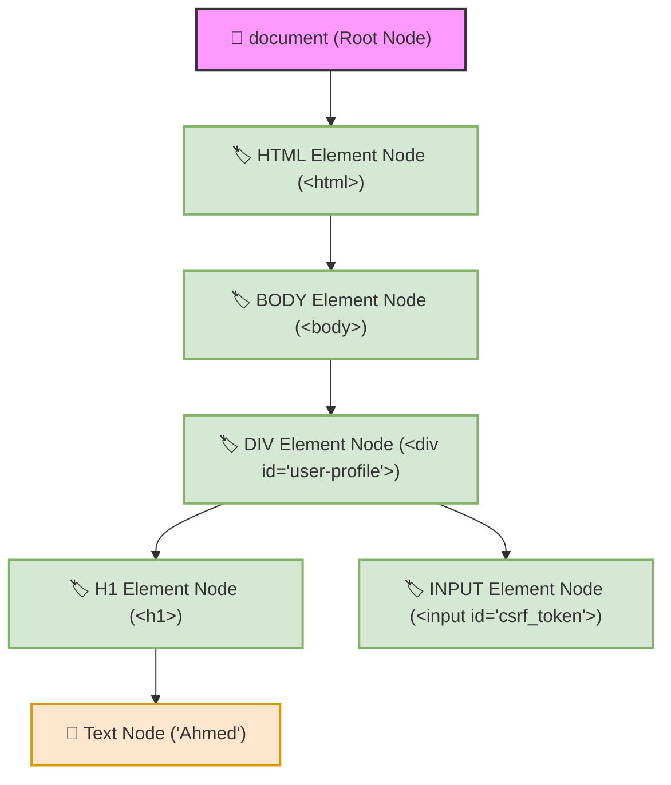

# 🌐 Lab 01: DOM Architecture — Document Tree, Node Types & Client-Side Execution Mechanics


## 📌 Overview

The **Document Object Model (DOM)** is an in-memory object representation of an HTML or XML document created by the web browser's engine. Understanding the structural distinction between static server-side HTML source code and the dynamic live DOM tree in memory (RAM) is fundamental to client-side penetration testing.

Client-side JavaScript executes entirely within the browser context, manipulating memory objects rather than modifying static files on the web server. When untrusted input infiltrates DOM manipulation sinks, attackers can manipulate the structural integrity of the DOM tree, leading to **DOM-based Cross-Site Scripting (DOM XSS)** and **DOM Clobbering**.

---

## ⚙️ DOM Tree Hierarchy & Component Breakdown

When a browser loads an HTTP response body, the HTML parser parses the raw string data into a hierarchical tree of live objects (**Nodes**):



### 1. The `Document` Object (Root Node)
* **Definition:** The top-level interface representing the entire webpage loaded in the browser context (`window.document`).
* **Security Significance:** Serves as the primary entry point for client-side DOM traversal and element querying (`document.getElementById()`, `document.querySelector()`). Gaining execution context with access to `document` grants attackers full control over all DOM elements, cookies, and session states within that origin.

### 2. Node Classification (`Node`)
* **Definition:** The base abstract class from which every object in the DOM tree inherits.
* **Node Types:**
  * **Element Nodes:** HTML tags (`<div>`, `<script>`, `<input>`, `<a>`).
  * **Text Nodes:** Plain textual string content residing inside HTML tags.
  * **Comment Nodes:** Hidden HTML comment structures (`<!-- comment -->`).
  * **Attribute Nodes:** Key-value pairs bound to HTML elements (`id="csrf_token"`).

### 3. The Security Boundary: Text Node vs. Element Node

The distinction between how web browsers parse and render **Text Nodes** versus **Element Nodes** represents the fundamental security boundary for script execution:

| Feature / Metric | Text Node (`Node.TEXT_NODE`) | Element Node (`Node.ELEMENT_NODE`) |
| :--- | :--- | :--- |
| **Parsing Mechanism** | Evaluated as literal, raw string data primitives. | Sent directly to the browser's HTML parser for DOM tree construction. |
| **Markup Execution** | 🛡️ **Immune to XSS.** `<script>` tags or inline event handlers are rendered as plain text. | 💥 **Vulnerable to XSS.** Embedded HTML/JS markup is interpreted and executed by the browser engine. |
| **Safe API Examples** | `textContent`, `innerText`, `createTextNode()` | `innerHTML`, `outerHTML`, `document.write()` |

---

## 🔄 DOM Traversal & Relationship Vectors

Elements within the DOM tree are organized hierarchically using parent-child-sibling relationships:

```html
<div id="user-profile">               <!-- Parent Node -->
    <h1 id="username">Ahmed</h1>       <!-- Child Node -->
    <input type="hidden" 
           id="csrf_token" 
           value="12345">             <!-- Sibling Node to #username -->
</div>
```

### Exploitation Mechanics via DOM Traversal
When direct execution or injection into target elements is restricted, attackers leverage DOM Traversal APIs (`parentElement`, `nextElementSibling`, `children`) to pivot across the tree:

* **Adjacent Secret Exfiltration:** An attacker who successfully injects a client-side script into an insecure child node (`#username`) can traverse upward to the parent (`#user-profile`) and across to adjacent siblings (`#csrf_token`) to extract anti-CSRF tokens or sensitive input parameters.
* **DOM Clobbering:** Overwriting global window properties or parent node structures to hijack control flow logic in application scripts.

---

## 🧪 Practical Scenarios, Questions & Technical Evaluations

### 🔹 Field Scenario: User Profile Rendering Mechanics Analysis

> [!CAUTION]
> **Field Condition:**  
> During a client-side code review of a single-page application (SPA), you inspect the JavaScript execution logic responsible for reflecting an authenticated user's profile name onto the screen.
> 
> You identify two distinct implementation patterns tested across two separate application sub-modules:
> * **Implementation A:** The application dynamically creates a **Text Node** containing the input string and appends it to the DOM tree.
> * **Implementation B:** The application creates an **Element Node** and assigns the input string directly into its markup rendering property.

* **Questions:**
  1. In which of the two implementations can a penetration tester successfully execute a **DOM-based XSS** payload such as `<script>alert(1)</script>`?
  2. What is the precise browser parsing mechanic that neutralizes the payload in the alternative implementation?

---

* **Student Analysis:**
  > **1. Vulnerable Implementation:** DOM XSS can be successfully executed under **Implementation B (Element Node)**. When the browser processes user input as an Element Node (or via dynamic HTML assignment like `innerHTML`), it routes the string through its HTML parser, interpreting the `<script>` tag as executable instruction code.  
  > **2. Safe Implementation Mechanics:** Under **Implementation A (Text Node)**, the browser treats `<script>alert(1)</script>` strictly as raw text string data. The HTML parser is never invoked, rendering the input payload harmlessly on the screen as literal text rather than executing it.

---

* **Technical Security Breakdown & Evaluation:**
  * **Verdict:** ✅ **100% Accurate Security Assessment.**
  * **Element Node Execution Mechanics (Implementation B):**  
    Passing unsanitized strings to properties that construct Element Nodes (e.g., `element.innerHTML = input`) forces the browser engine to tokenize and parse the incoming input as HTML markup. When the parser encounters elements like `<script>` or event attributes (``), it immediately compiles and executes the JavaScript payload within the document's origin context.
  * **Text Node Safety Mechanics (Implementation A):**  
    Methods such as `document.createTextNode(input)` or binding input to `element.textContent` bypass the browser's HTML tokenizer entirely. The browser assigns the string directly to an isolated text primitive node in RAM, neutralizing script injection attempts without requiring manual string sanitization or encoding.
