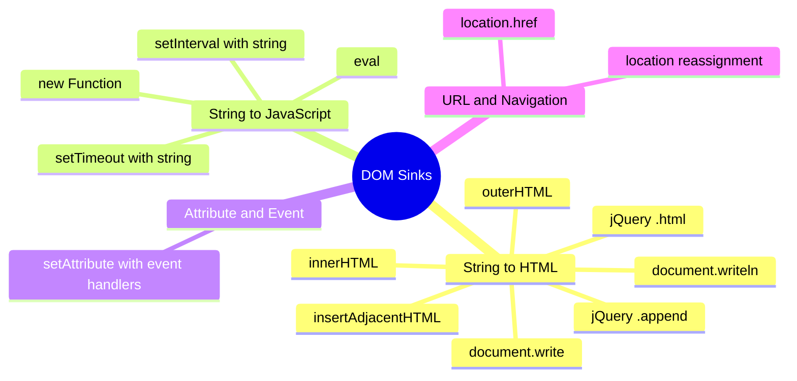
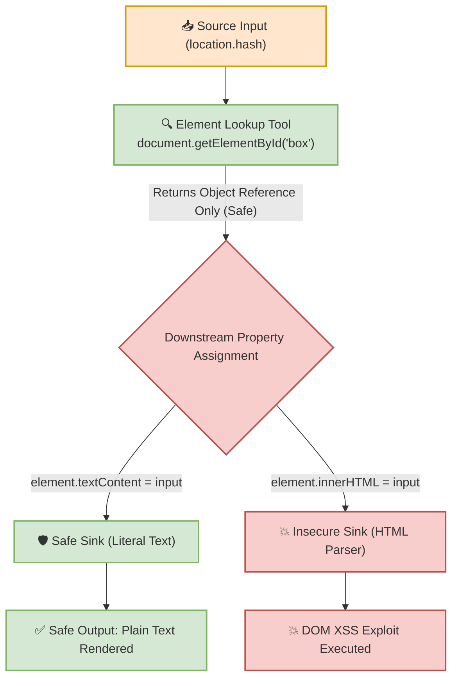

# 🌐 Lab02: DOM Sinks — Execution Mechanisms, Detailed Vulnerability Vectors & Categorization


## 📌 Overview

In client-side security auditing, a **DOM Sink** is a JavaScript function, property, or DOM API that receives data from an untrusted input point (a **Source**) and processes, evaluates, or renders it dynamically within the browser.

If an application passes unsanitized user-controlled data into an insecure sink, the browser converts raw text strings into executable DOM markup, runtime code, or redirection triggers, leading to **DOM-based Cross-Site Scripting (DOM XSS)**, **JavaScript Injection**, or **Open Redirect** vulnerabilities.

---

## ⚙️ Core Identification Principles

To evaluate sinks during source-to-sink code analysis, penetration testers apply the following decision framework:

> [!TIP]
> **Golden Rule of Sink Identification:**
> * **Unsafe Sink:** Any function or API property that interprets, parses, or executes input strings as **HTML markup**, **JavaScript code**, **Event Handlers**, or **Executable Navigation URIs**.
> * **Safe Sink / Access Tool:** Any function or API property that handles input strictly as **literal text strings** (`textContent`, `innerText`) or performs read-only element references (`getElementById`, `querySelector`).

---

## 🛠️ Detailed Technical Breakdown of Sinks

### Category 1: String → HTML Interpretation (DOM Parsing Sinks)

#### 1. `innerHTML`
* **Mechanics:** Reads or replaces the internal HTML markup residing inside an element. Passing a string to `innerHTML` clears existing inner nodes and forces the browser engine to invoke its HTML parser.
* **Code Example:**
  ```javascript
  const element = document.getElementById("box");
  element.innerHTML = "<b>TEST</b>"; 
  // Existing inner content is cleared; "<b>TEST</b>" is parsed and rendered as HTML markup.
  ```
* **Security Risk:** High. Any string containing HTML tags or event attributes (e.g., ``) is parsed and executed immediately.

#### 2. `outerHTML`
* **Mechanics:** Unlike `innerHTML` (which modifies only child nodes), `outerHTML` replaces the target element itself along with all of its inner content.
* **Code Comparison:**
  ```javascript
  // Given: <div id="box">Hello</div>
  console.log(element.innerHTML);  // Output: "Hello"
  console.log(element.outerHTML); // Output: "<div id=\"box\">Hello</div>"
  ```
* **Security Risk:** High. Replacing the entire element with unsanitized user input allows attackers to inject arbitrary top-level HTML tags or overwrite container structures.

#### 3. `document.write()`
* **Mechanics:** Writes raw data strings directly into the HTML document stream during initial page parsing.
* **Code Example:**
  ```javascript
  document.write("<h1>Hello</h1>"); // Parses string directly as HTML markup.
  ```
* **Security Risk:** Critical. If invoked after document load completes, `document.write()` completely overwrites the existing HTML document. Passing unsanitized input leads to direct DOM XSS.

#### 4. `document.writeln()`
* **Mechanics:** Functions identically to `document.write()`, but appends a newline character (`\n`) to the written stream.
* **Code Example:**
  ```javascript
  document.writeln("Hello");
  document.writeln("World");
  ```
* **Security Note:** The appended newline exists in the source code stream only and does not render as a visual line break in HTML (which requires `<br>`). It carries the same critical XSS risk as `document.write()`.

#### 5. `element.insertAdjacentHTML()`
* **Mechanics:** Inserts raw HTML markup at a specified position relative to the target element.
* **API Syntax:** `element.insertAdjacentHTML(position, htmlString)`
* **Supported Positional Values:**
  * `beforebegin`: Inserts HTML immediately *before* the element itself.
  * `afterbegin`: Inserts HTML *inside* the element, before its first child.
  * `beforeend`: Inserts HTML *inside* the element, after its last child.
  * `afterend`: Inserts HTML immediately *after* the element itself.

```text
        beforebegin
             ↓
       <div id="box">
          ↑
     afterbegin
          ↓
        [ Existing Content ]
          ↑
      beforeend
          ↓
       </div>
             ↓
         afterend
```

* **Security Risk:** High. Any unsanitized string passed into the `html` parameter across all four positional slots is parsed by the HTML parser and executed.

#### 6. `jQuery .html()`
* **Mechanics:** Wrapper API in the jQuery library equivalent to vanilla JavaScript's `element.innerHTML`.
* **Code Example:**
  ```javascript
  $("#box").html("<b>TEST</b>"); // Clears existing content and inserts parsed HTML.
  ```
* **Security Risk:** High. Replaces inner content with parsed HTML strings. Insecure handling of dynamic inputs creates DOM XSS.

#### 7. `jQuery .append()`
* **Mechanics:** Appends HTML content to the end of the selected element(s), preserving existing child nodes.
* **Code Example:**
  ```javascript
  // Given: <div id="box">Hello</div>
  $("#box").append("<b>TEST</b>"); 
  // Result: <div id="box">Hello<b>TEST</b></div>
  ```
* **Functional Alignment:** Conceptually equivalent to `insertAdjacentHTML("beforeend", ...)` in vanilla DOM APIs.

---

### Category 2: String → JavaScript Execution (Code Evaluation Sinks)

#### 8. `eval()`
* **Mechanics:** Accepts a string parameter and evaluates it directly as dynamic JavaScript instruction code within the active runtime execution context.
* **Execution Flow:**
  $$\text{String Input} \longrightarrow \mathtt{eval()} \longrightarrow \text{JavaScript Code} \longrightarrow \text{Execution}$$
* **Code Example:**
  ```javascript
  eval("2 + 3");                   // Evaluates arithmetic: returns 5
  eval("console.log('Hello')");    // Executes statement: logs 'Hello'
  ```
* **Security Risk:** Critical. Allows arbitrary JavaScript code execution if supplied with untrusted input strings.

#### 9. `setTimeout()` *(String Parameter)*
* **Mechanics:** Delays code execution. When passed a function reference, it executes safely. However, when passed a string primitive as its first argument, it functions as an inline code evaluator.
* **Insecure Pattern:**
  ```javascript
  // Insecure: Converts string to executable code after 2000ms
  setTimeout("console.log('Hello')", 2000); 
  ```
* **Remediation:** Pass anonymous functions or callback references exclusively:
  ```javascript
  // Secure callback pattern
  setTimeout(() => { console.log('Hello'); }, 2000);
  ```

#### 10. `setInterval()` *(String Parameter)*
* **Mechanics:** Repeats execution at specified time intervals. Like `setTimeout()`, passing a string argument causes the browser to parse and execute the string as JavaScript code continuously.
* **Insecure Pattern:**
  ```javascript
  setInterval("executeTask()", 2000); // Evaluates string as code every 2 seconds
  ```
* **Remediation:** Use function callback references (`setInterval(fn, 2000)`).

#### 11. `Function()` Constructor
* **Mechanics:** Dynamically instantiates a new `Function` object from string arguments.
* **Code Example:**
  ```javascript
  const add = new Function("a", "b", "return a + b");
  console.log(add(2, 3)); // Returns 5
  ```
* **Evaluation Comparison:**
  * `eval("...")`: Evaluates and executes JavaScript code immediately in the current scope.
  * `new Function("...")`: Compiles the string into a reusable `Function` object that executes when invoked.
* **Security Risk:** Critical. Both APIs treat string input as active source code.

---

### Category 3: Attribute & Event Handler Sinks

#### 12. `element.setAttribute()`
* **Mechanics:** Sets or updates the value of a specified attribute on an HTML element.
* **API Syntax:** `element.setAttribute(attributeName, value)`
* **Code Example:**
  ```javascript
  element.setAttribute("class", "box"); // Assigns class="box" (Safe attribute context)
  ```

#### 13. `setAttribute()` with Inline Event Handlers
* **Mechanics:** Passing event handler attributes (e.g., `onclick`, `onerror`, `onload`, `onmouseover`) to `setAttribute()` transforms standard attribute assignment into executable JavaScript event contexts.
* **Insecure Pattern:**
  ```javascript
  element.setAttribute("onclick", "alert('Hello')");
  // Rendered DOM: <button onclick="alert('Hello')">Click</button>
  ```
* **Security Risk:** High. Attaching user-controlled strings to event handler attributes allows attackers to inject arbitrary script execution triggers upon user interaction.

---

### Category 4: URL & Navigation Sinks

#### 14. `location.href`
* **Mechanics:** Reads or assigns the current URL context of the browser window. Assigning a new string triggers browser navigation.
* **Code Example:**
  ```javascript
  console.log(location.href);         // Reads current URL string
  location.href = "[https://example.com](https://example.com)"; // Navigates browser to new origin
  ```
* **Security Risk:** High. If assigned a pseudo-protocol string (e.g., `javascript:alert(1)`), the browser executes the inline script within the current origin context instead of navigating.

#### 15. `Location Reassignment` (`location = ...`)
* **Mechanics:** Direct assignment to the `location` object implicitly invokes `location.href` setter mechanics.
* **Code Example:**
  ```javascript
  location = "[https://example.com](https://example.com)"; // Implicit redirection
  ```
* **Security Risk:** High. Subject to the exact same pseudo-protocol execution (`javascript:`) and Open Redirect hazards as explicit `location.href` assignments.

---

### Category 5: Library Selection Sinks

#### 16. `jQuery $()` Selector Wrapper
* **Mechanics:** The primary jQuery constructor `$()` is designed for element querying (`$("#box")`, `$(".item")`). However, if a string passed to `$()` starts with an HTML opening tag (`<`), jQuery passes the string to its internal HTML parser to construct new DOM elements dynamically.
* **Security Risk:** High. If user input begins with HTML markup (e.g., `$("")`), jQuery instantiates and executes the injected markup automatically.

---

## 📊 Summary Categorization Matrix of DOM Sinks



| Sink Category | Specific APIs / Properties | Operational Outcome | Primary Security Mitigation |
| :--- | :--- | :--- | :--- |
| **String $\rightarrow$ HTML** | `innerHTML`, `outerHTML`, `document.write()`, `document.writeln()`, `insertAdjacentHTML()`, `$.html()`, `$.append()` | Parses input string as HTML markup and appends nodes to DOM tree. | Use `textContent`, `innerText`, or sanitize via DOMPurify. |
| **String $\rightarrow$ JavaScript** | `eval()`, `setTimeout("...")`, `setInterval("...")`, `new Function()` | Evaluates input string as active JavaScript runtime code. | Avoid code evaluation APIs; use function callbacks & `JSON.parse()`. |
| **Attribute / Event** | `setAttribute("onclick", ...)` | Binds string to DOM element event triggers. | Use `addEventListener('click', fn)` for event handling. |
| **URL / Navigation** | `location.href`, `location = ...` | Redirects browser context or executes `javascript:` URIs. | Validate URI scheme strictly (`http:` or `https:`) before redirecting. |

---

## 🔍 Selector APIs vs. Insecure Sinks

Element selector methods such as `document.getElementById()` and `document.querySelector()` are **Safe Access Tools**, not sinks.



* `document.getElementById('user_id')`: Query operation only. Traverses the DOM tree and returns an element reference without parsing or executing content.
* `document.querySelector('.user-class')`: CSS selector lookup tool. Performs read-only matching.
* **Root Cause of Vulnerability:** Danger is introduced **only** when the returned element reference is chained downstream to an execution sink (e.g., `document.getElementById('box').innerHTML = input`).

---

## 🧪 Practical Scenarios, Questions & Technical Evaluations

### 🔹 Field Scenario: Code Audit & Sink Identification

> [!CAUTION]
> **Field Condition:**  
> During a code review of a single-page client application, you isolate two distinct JavaScript routines processing a query parameter extracted from `location.search`:
> 
> ```javascript
> // Routine A:
> let container = document.getElementById('notice_box');
> container.innerHTML = decodeURIComponent(location.search.substring(1));
> 
> // Routine B:
> let container = document.getElementById('notice_box');
> container.textContent = decodeURIComponent(location.search.substring(1));
> ```

* **Questions:**
  1. Why is `document.getElementById()` in Routine A not classified as the root cause sink, and which specific API creates the **DOM XSS** risk?
  2. How does Routine B prevent payload execution, and what is the primary distinction between `String -> HTML` sinks and `String -> Text` primitive assignments?

---

* **Student Analysis:**
  > **1. Routine A Evaluation:** `document.getElementById()` is merely a DOM lookup API that retrieves an element node reference; it does not parse or execute input. The vulnerable sink is **`innerHTML`**. Passing the unsanitized `location.search` value to `innerHTML` forces the browser's HTML parser to process the string, executing vector tags such as ``.  
  > **2. Routine B Evaluation:** Routine B uses **`textContent`**, which assigns input strictly to a Text Node primitive in memory. The browser bypasses HTML tokenization completely, rendering the string safely on screen as literal text without evaluating embedded HTML markup or JavaScript code.

---

* **Technical Security Breakdown & Evaluation:**
  * **Verdict:** ✅ **100% Accurate Security Assessment.**
  * **Parser Mechanics (Routine A vs. Routine B):**  
    Routine A passes untrusted data into an HTML Parsing Sink (`innerHTML`). When the HTML tokenizer encounters tags or event handler attributes, it instantiates element nodes and evaluates inline scripts within the current document's security origin.  
    Routine B assigns data to a Text Primitive Property (`textContent`). This invokes string primitive rendering mechanisms, neutralizing script injection attempts by escaping visual HTML characters without executing code.
