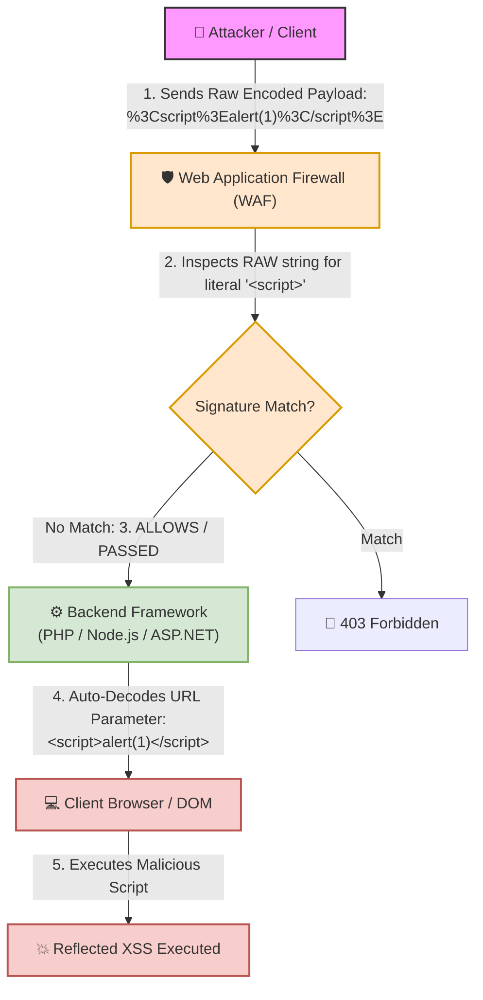

# 🌐 Lab 11: URL Encoding (Percent-Encoding) & Filter/WAF Bypass

## 📌 Overview

**URL Encoding** (also known as **Percent-Encoding**) is a standard mechanism used to convert special and reserved characters within Web Uniform Resource Locators (URLs) into a safe, unambiguous format that web browsers and web servers can reliably transmit and interpret over HTTP. In security assessments, understanding URL encoding is essential for identifying **Input Normalization flaws** and executing **Web Application Firewall (WAF) / Filter Bypass** techniques.

---

## 📊 Quick Reference Table

| Original Character | URL Encoded (Hex) | Purpose & Vulnerability Context |
| :---: | :---: | :--- |
| ` ` *(Space)* | `%20` or `+` | Separating SQL commands or payload arguments. |
| `<` | `%3C` | Opening HTML tags for Cross-Site Scripting (XSS). |
| `>` | `%3E` | Closing HTML tags for XSS payloads. |
| `'` *(Single Quote)* | `%27` | Breaking string literals in SQLi or HTML attributes. |
| `"` *(Double Quote)* | `%22` | Breaking out of HTML string attributes. |
| `&` | `%26` | Parameter Tampering and HTTP parameter separation. |

---

## ⚙️ Mechanics of URL Encoding (Percent-Encoding)

### 1. Why is URL Encoding Necessary?
HTTP URLs rely exclusively on a limited subset of the **US-ASCII Standard** character set. Characters within a URL fall into two distinct structural categories:

* **Reserved Characters:** Characters that hold structural meaning within a URL scheme (e.g., `?` denotes query parameter start, `=` assigns values, and `&` separates parameters).
* **Unreserved / Unsafe Characters:** Characters that either lack structural meaning or cause transmission errors if passed in cleartext.

To pass reserved or unsafe characters as literal data within a URL parameter without disrupting the URL's syntax, each character is replaced by a `%` symbol followed by its **2-digit Hexadecimal (Hex)** representation in the ASCII table.

---

## 🛠️ Filter & WAF Bypass Dynamics

### 1. The Decoding Order Flaw (Procedural Order)
WAF and security filter bypasses using URL encoding stem from an **Execution Order / Decoding Order Mismatch** between the security filter and the backend application engine.

### 2. Failure Analysis
* **Flaw Execution:** The security filter inspects the incoming raw HTTP request string **before** input normalization occurs.
* **Bypass Mechanism:** A naive WAF signature searches specifically for explicit literal string patterns like ``  
>    **Result:** The application responds with `403 Forbidden - Malicious Input Detected` triggered by a WAF filter.  
> 2. You re-submit the payload after encoding special characters into URL-encoded format: `%3Cscript%3Ealert(1)%3C/script%3E`  
>    **Result:** The server accepts the request with `HTTP 200 OK`, and the JavaScript code executes inside the user's browser.

* **Questions:**
  1. What entity is responsible for this successful bypass (a bug in the browser, the WAF, or the backend server code)?
  2. Where did the improper sequence in inspecting and interpreting the request occur?

---

* **Student Analysis:**
  > **Cause:** The bypass succeeded due to URL Encoding, which prevented the firewall from detecting that the input contained `script`, leading it to accept the request.  
  > **Sequence Flaw:** The request must be interpreted and decoded *before* reaching or being evaluated by the firewall rules so that the firewall can easily detect and block malicious payloads.

---

* **Technical Security Breakdown & Evaluation:**
  * **Verdict:** ✅ **100% Accurate Security Assessment.**
  * **Responsible Entity:** The **Web Application Firewall (WAF) / Security Filter**.
  * **Improper Sequence Breakdown:**  
    The fundamental flaw is a **Failure of Input Normalization**. The WAF evaluated the request in its raw, URL-encoded format (`%3Cscript%3E`) and passed it through because it did not match the literal signature string `<script>`.
  * **Required Defensive Sequence (Remediation):**  
    The security inspection pipeline must perform **Input Normalization** (decoding URL-encoded input and standardizing format representations) **prior** to running signature detection rules. Once normalized, the WAF will inspect the payload in its true expanded state (`<script>`) and issue an immediate `403 Blocked` response before the request ever touches the backend engine.

---
