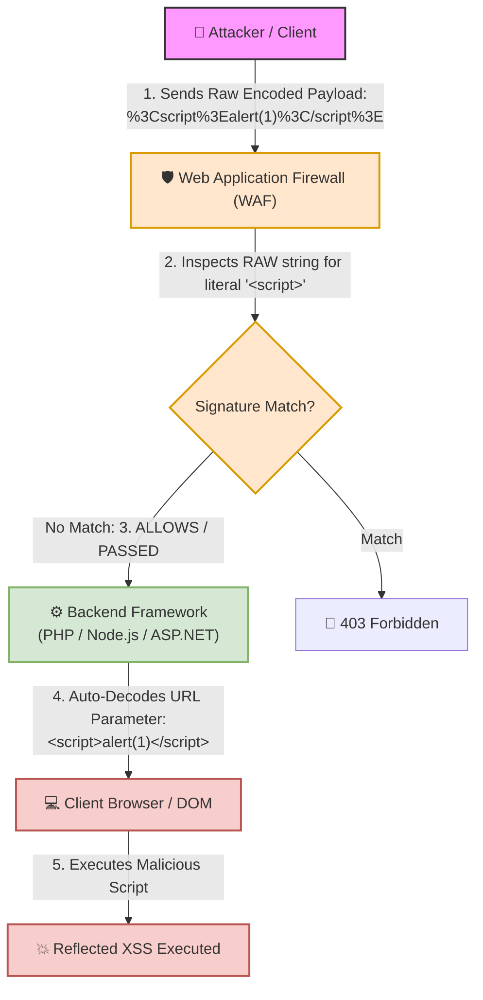

# 🌐 Lab 11: URL Encoding, Context-Aware Encoding & WAF Bypass


## 📌 Overview

**URL Encoding** (also known as **Percent-Encoding**) is a standard mechanism used to convert special and reserved characters within Web Uniform Resource Locators (URLs) into a safe, unambiguous format that web browsers and web servers can reliably transmit over HTTP. 

However, encoding in web security goes beyond URL transmission. To effectively sanitize input and defend against **Cross-Site Scripting (XSS)** and **WAF Bypasses**, developers and security auditors must understand **Context-Aware Encoding**. Applying the wrong encoding type for a specific HTML/JS context will fail to mitigate vulnerabilities.

---

## 📊 Quick Reference Table: URL Encoding

| Original Character | URL Encoded (Hex) | Purpose & Vulnerability Context |
| :---: | :---: | :--- |
| ` ` *(Space)* | `%20` or `+` | Separating SQL commands or payload arguments. |
| `<` | `%3C` | Opening HTML tags for Cross-Site Scripting (XSS). |
| `>` | `%3E` | Closing HTML tags for XSS payloads. |
| `'` *(Single Quote)* | `%27` | Breaking string literals in SQLi or HTML attributes. |
| `"` *(Double Quote)* | `%22` | Breaking out of HTML string attributes. |
| `&` | `%26` | Parameter Tampering and HTTP parameter separation. |

---

## ⚙️ Mechanics of URL Encoding (Percent-Encoding)

### 1. Why is URL Encoding Necessary?
HTTP URLs rely exclusively on a limited subset of the **US-ASCII Standard** character set. Characters within a URL fall into two distinct structural categories:

* **Reserved Characters:** Characters that hold structural meaning within a URL scheme (e.g., `?` denotes query parameter start, `=` assigns values, and `&` separates parameters).
* **Unreserved / Unsafe Characters:** Characters that either lack structural meaning or cause transmission errors if passed in cleartext.

To pass reserved or unsafe characters as literal data within a URL parameter without disrupting the URL's syntax, each character is replaced by a `%` symbol followed by its **2-digit Hexadecimal (Hex)** representation in the ASCII table.

---

## 🛠️ Filter & WAF Bypass Dynamics

### 1. The Decoding Order Flaw (Procedural Order)
WAF and security filter bypasses using URL encoding stem from an **Execution Order / Decoding Order Mismatch** between the security filter and the backend application engine.



### 2. Failure Analysis
* **Flaw Execution:** The security filter inspects the incoming raw HTTP request string **before** input normalization occurs.
* **Bypass Mechanism:** A naive WAF signature searches specifically for explicit literal string patterns like `<script>`. When the attacker submits `%3Cscript%3E`, the raw signature check fails to match.
* **Backend Execution:** The WAF permits the request to pass. Upon arrival at the backend server framework (e.g., PHP, Express, ASP.NET), the framework automatically URL-decodes parameter values into `<script>`, causing the malicious payload to execute.

---

## 🎯 Context-Aware Encoding (Why HTML Encoding Fails in Non-HTML Contexts)

> [!IMPORTANT]
> **Core Rule:** The type of encoding applied must strictly match the **Context** where user input is rendered. Applying standard HTML Entity Encoding (`&lt;`, `&gt;`) outside plain HTML body elements will fail to prevent XSS.

### 1. Context 1: Inside `<script>` Tags

#### ❌ The Misconception:
```html
<script>
    var username = "&lt;script&gt;alert(1)&lt;/script&gt;";
</script>
```
Developers assume this is safe because `<` was converted to `&lt;`. However, browsers do **not** parse HTML entities inside execution blocks like `<script>`.

#### 💥 The Real Threat (Breaking Out of String Literals):
The danger inside a `<script>` block is not inserting `<script>` tags, but rather **breaking out of the string literal boundary**.

Consider the following vulnerable server-side template:
```html
<script>
    var username = "USER_INPUT";
</script>
```

If an attacker supplies `";alert(1);//` as `USER_INPUT`, the rendered DOM becomes:
```javascript
var username = "";alert(1);//";
```
The string is closed prematurely, executing `alert(1)` in the JavaScript engine.

#### ❓ Why HTML Encoding Fails Here:
Standard HTML Encoding only sanitizes characters like `<`, `>`, and `&`. It leaves critical JavaScript delimiters intact:
* `"` *(Double Quote)*
* `'` *(Single Quote)*
* `\` *(Backslash)*
* `/` *(Forward Slash)*

#### ✅ Proper Defense:
Use **JavaScript String Encoding** (Unicode/Hex escaping such as `\x22` or `\u0022`) or completely avoid rendering untrusted dynamic data inside inline `<script>` blocks (prefer JSON endpoints or data attributes).

---

### 2. Context 2: Inside Event Handlers (`onclick`, `onload`, `onerror`)

#### ❌ The Misconception:
```html
<button onclick="console.log('USER_INPUT')">Click Me</button>
```

If an attacker inputs `');alert(1);//`, the rendered code becomes:
```html
<button onclick="console.log('');alert(1);//')">Click Me</button>
```
When clicked, the browser executes `console.log('')` followed immediately by `alert(1)`.

#### ❓ Why HTML Encoding Fails Here:
An event handler attribute is **JavaScript embedded inside an HTML attribute**. Standard HTML encoding does not prevent JavaScript syntax manipulation within the inline script parser.

#### ✅ Proper Defense:
Requires **Combinatorial Encoding**:
1. First, apply **JavaScript Encoding** (to secure the payload inside the JS logic).
2. Second, apply **HTML Attribute Encoding** (to secure the payload within the HTML attribute context).

---

### 3. Context 3: Inside `href` and `src` URI Attributes

#### ❌ The Misconception:
```html
<a href="USER_INPUT">View Profile</a>
```

If an attacker inputs `javascript:alert(1)`, the rendered DOM becomes:
```html
<a href="javascript:alert(1)">View Profile</a>
```
When clicked, the browser executes the `javascript:` pseudo-protocol, triggering `alert(1)`.

#### ❓ Why HTML Encoding Fails Here:
`javascript:alert(1)` contains no `<` or `>` characters. HTML encoding leaves the string completely unchanged:
```html
href="javascript:alert(1)"
```

#### ✅ Proper Defense:
* **Protocol / Scheme Validation:** Enforce strict URL scheme whitelisting at the server layer.
* **Allowed Protocols:** `https:`, `http:`, `mailto:`
* **Blocked Protocols:** `javascript:`, `data:`, `vbscript:`

---

### 💡 Why Is It Called "Context"?

| Rendered Location | Example Syntax | Required Defensive Encoding |
| :--- | :--- | :--- |
| **HTML Body** | `<div>USER_INPUT</div>` | **HTML Entity Encoding** (`&lt;`, `&gt;`, `&quot;`) |
| **JavaScript Block** | `<script>var x="USER_INPUT";</script>` | **JavaScript Unicode/Hex Encoding** (`\xHH`) |
| **HTML Attribute** | `<input value="USER_INPUT">` | **HTML Attribute Encoding** |
| **URL Parameter** | `<a href="/page?q=USER_INPUT">` | **URL / Percent Encoding** (`%XX`) |
| **URI Attribute** | `<a href="USER_INPUT">` | **URL Scheme Whitelisting** (`https://` only) |

---

## 🧪 Practical Scenarios, Questions & Technical Evaluations

### 🔹 Field Scenario: Reflected XSS WAF Bypass via URL Encoding

> [!CAUTION]
> **Field Condition:**  
> While auditing a search endpoint at `https://target.com/search?q=test`, you test for Reflected XSS.  
> 1. You submit the payload in cleartext: `<script>alert(1)</script>`  
>    **Result:** The application responds with `403 Forbidden - Malicious Input Detected` triggered by a WAF filter.  
> 2. You re-submit the payload after encoding special characters into URL-encoded format: `%3Cscript%3Ealert(1)%3C/script%3E`  
>    **Result:** The server accepts the request with `HTTP 200 OK`, and the JavaScript code executes inside the user's browser.

* **Questions:**
  1. What entity is responsible for this successful bypass (a bug in the browser, the WAF, or the backend server code)?
  2. Where did the improper sequence in inspecting and interpreting the request occur?

---

* **Student Analysis:**
  > **Cause:** The bypass succeeded due to URL Encoding, which prevented the firewall from detecting that the input contained `script`, leading it to accept the request.  
  > **Sequence Flaw:** The request must be interpreted and decoded *before* reaching or being evaluated by the firewall rules so that the firewall can easily detect and block malicious payloads.

---

* **Technical Security Breakdown & Evaluation:**
  * **Verdict:** ✅ **100% Accurate Security Assessment.**
  * **Responsible Entity:** The **Web Application Firewall (WAF) / Security Filter**.
  * **Improper Sequence Breakdown:**  
    The fundamental flaw is a **Failure of Input Normalization**. The WAF evaluated the request in its raw, URL-encoded format (`%3Cscript%3E`) and passed it through because it did not match the literal signature string `<script>`.
  * **Required Defensive Sequence (Remediation):**  
    The security inspection pipeline must perform **Input Normalization** (decoding URL-encoded input and standardizing format representations) **prior** to running signature detection rules. Once normalized, the WAF will inspect the payload in its true expanded state (`<script>`) and issue an immediate `403 Blocked` response before the request ever touches the backend engine.

---
