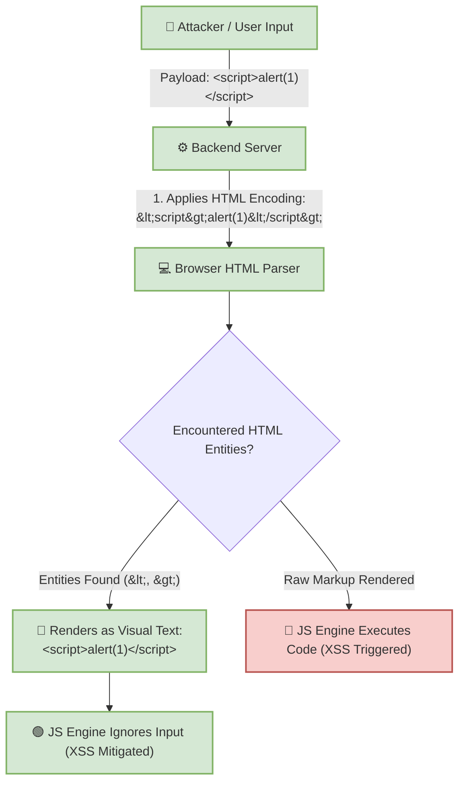

# 🛡️ Lab 12: HTML Encoding (Entities) — Direct Defense Against XSS


## 📌 Overview

**HTML Encoding** (also known as **HTML Entity Encoding**) is the process of converting characters with structural meaning in HTML into their corresponding **HTML Entities**. Its primary objective is to instruct the browser's HTML parser to treat input strictly as **Data/Text for visual rendering**, rather than as **Executable Code/Markup**.

---

## ⚙️ How HTML Encoding Works

When a browser receives an HTML document, its **HTML Parser** reads elements and tags (such as `<h1>` or `<script>`). If the parser encounters characters like `<` or `>` encoded as HTML Entities, it renders the visual shape of the character on screen without interpreting it as a syntax delimiter or tag boundary.

### 📊 Basic HTML Sanitization Reference Table

| Original Character | HTML Entity | Meaning to the HTML Parser |
| :---: | :---: | :--- |
| `<` | `&lt;` | Text "Less Than"; **Not** an opening tag bracket. |
| `>` | `&gt;` | Text "Greater Than"; **Not** a closing tag bracket. |
| `"` | `&quot;` | Text "Double Quote". |
| `'` | `&#39;` or `&apos;` | Text "Single Quote". |
| `&` | `&amp;` | Text "Ampersand" symbol. |

---

## 🛠️ Defeating Cross-Site Scripting (XSS) with HTML Encoding

### 1. Without HTML Encoding (Vulnerable)
If a user submits `<script>alert(1)</script>` into a comment field and the server stores and reflects it raw:
* The browser parses `<script>` as a genuine HTML tag.
* The JavaScript engine executes the script immediately, resulting in **Stored XSS**.

### 2. With HTML Encoding (Protected)
The server encodes the input prior to rendering:
`&lt;script&gt;alert(1)&lt;/script&gt;`
* The browser displays `<script>alert(1)</script>` as literal text on screen.
* The JavaScript engine **never executes** the payload because the parser does not recognize it as an executable tag.



---

## ⚠️ The Common Trap: Context Changes Everything!

HTML Encoding provides robust protection **only when user input is displayed between standard HTML body tags** (e.g., `<div>` or `<p>`). It can fail completely when input is placed in non-standard execution contexts.

### 1. Context 1: Inside Inline `<script>` Tags

#### ❌ Code Example:
```html
<script>
    var username = "&lt;script&gt;alert(1)&lt;/script&gt;";
</script>
```
While `<` was replaced with `&lt;`, browsers do **not** decode or interpret HTML entities inside JavaScript execution blocks.

#### 💥 Real Danger (Breaking Out of String Literals):
If the server places user input dynamically inside a script string:
```html
<script>
    var username = "USER_INPUT";
</script>
```
If `USER_INPUT` contains `";alert(1);//`, the rendered code becomes:
```javascript
var username = "";alert(1);//";
```
JavaScript executes the injected `alert(1)`.

#### ❓ Why HTML Encoding Fails:
HTML Encoding sanitizes `<`, `>`, and `&`, but leaves key JavaScript delimiters intact:
* `"` *(Double Quote)*
* `'` *(Single Quote)*
* `\` *(Backslash)*
* `/` *(Forward Slash)*

**Solution:** Use **JavaScript String Encoding** or avoid embedding dynamic input inside `<script>` blocks.

---

### 2. Context 2: Inside Inline Event Handlers (`onclick`, `onerror`, `onload`)

#### ❌ Code Example:
```html
<button onclick="console.log('USER_INPUT')">
```
If `USER_INPUT` is set to `');alert(1);//`, the code becomes:
```html
<button onclick="console.log('');alert(1);//')">
```
Clicking the button executes `console.log('')` and then `alert(1)`.

#### ❓ Why HTML Encoding Fails:
An event handler attribute contains **JavaScript embedded within an HTML attribute**. Standard HTML encoding does not protect JavaScript syntax logic inside `onclick`.

**Solution:** Requires **Combinatorial Encoding** (HTML Attribute Encoding + JavaScript Encoding).

---

### 3. Context 3: Inside `href` and `src` URI Attributes

#### ❌ Code Example:
```html
<a href="USER_INPUT">Profile</a>
```
If `USER_INPUT` is set to `javascript:alert(1)`, the code becomes:
```html
<a href="javascript:alert(1)">Profile</a>
```
Clicking the link executes the `javascript:` pseudo-protocol payload.

#### ❓ Why HTML Encoding Fails:
The input `javascript:alert(1)` contains no `<`, `>`, or `&` characters. HTML encoding leaves `javascript:` unchanged.

**Solution:** Perform **URL Scheme / Protocol Validation** at the server level:
* **Allowed Schemes:** `https:`, `http:`, `mailto:`
* **Blocked Schemes:** `javascript:`, `data:`, `vbscript:`

---

### 💡 Context Comparison Summary

If an attacker inputs `"><script>alert(1)</script>`:

```
+------------------------------------------+------------------------------------------+
| Context: HTML Body                       | Context: Inline JavaScript               |
| <div>USER_INPUT</div>                    | <script>var x="USER_INPUT";</script>     |
+------------------------------------------+------------------------------------------+
| HTML Encoding Result:                    | Vulnerability Status:                    |
| &quot;&gt;&lt;script&gt;...              | Fails! Requires JavaScript Context       |
| (Sufficient Protection)                  | Encoding to prevent string breakout.     |
+------------------------------------------+------------------------------------------+
```

---

## 🧪 Practical Scenarios, Questions & Technical Evaluations

### 🔹 Scenario: Universal HTML Encoding on `href` Attributes

> [!CAUTION]
> **Field Condition:**  
> A web developer implemented global HTML Encoding across all user inputs to mitigate XSS. On a user profile page, the developer inserted the username into a link attribute:
> ```html
> <a href="USER_INPUT">My Profile</a>
> ```
> An attacker sets their username to:
> `javascript:alert(document.cookie)`
>
> The server renders the following HTML output:
> ```html
> <a href="javascript:alert(document.cookie)">My Profile</a>
> ```

* **Questions:**
  1. Did HTML Encoding prevent Cross-Site Scripting (XSS) in this context? Why or why not?
  2. What occurs when a victim clicks this link?

---

* **Student Analysis:**
  > **1. Defense Status:** No, HTML Encoding failed because there were no structural HTML characters (like `<`, `>`, or `&`) for the encoding algorithm to sanitize.  
  > **2. Execution Result:** When the victim clicks the link, the browser triggers a GET request/session cookie invocation, executing the JavaScript payload within the victim's session context.

---

* **Technical Security Breakdown & Evaluation:**
  * **Verdict:** ✅ **100% Accurate Assessment.**
  * **Root Cause Analysis:**  
    HTML Encoding is designed to prevent HTML tag injection and attribute escape sequence manipulation (by neutralizing `<` and `>`). In a URI context (`href`), the attacker did not need to write HTML tags; they leveraged an executable **URI Scheme** (`javascript:`). Because the payload consisted of plain ASCII characters, HTML encoding left the payload intact.
  * **Execution Mechanism:**  
    When the victim clicks the link, the browser reads the `javascript:` pseudo-protocol prefix and executes the JavaScript code directly in the DOM (Client-side execution) within the victim's active session context.
  * **Engineering Defense (Remediation):**  
    Relying solely on HTML Encoding for URI attributes is insufficient. The application must implement strict **URL Scheme Validation** to verify that incoming links begin with explicit safe protocols (`https://` or `http://`) before rendering them into `href` or `src` attributes.

---
