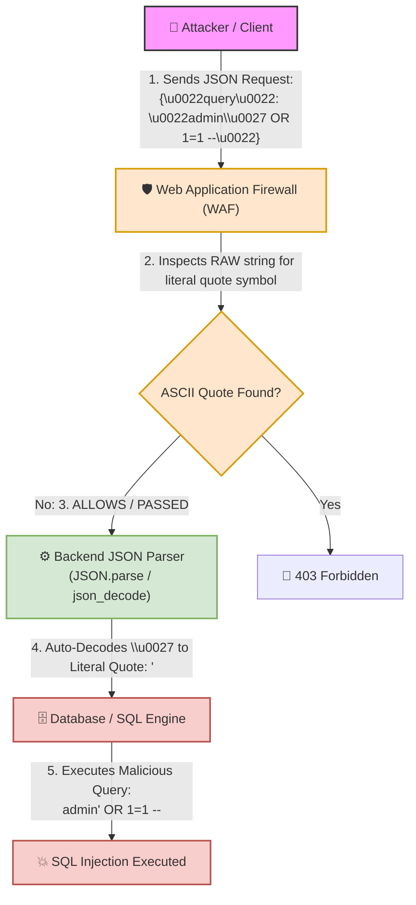

# 🌐 Lab 14: Unicode Encoding (\u0027) — Hidden Transmission via Interpretation Engines


## 📌 Overview

**Unicode** is the universal character encoding standard designed to represent and display text consistently across different languages, operating systems, and platforms. Before Unicode, computers relied on fragmented character sets (such as ASCII and localized encodings), which often resulted in character corruption (**Mojibake**) when transmitted across different systems.

In web application security, **Unicode Escape Sequences** (`\uXXXX`) present a significant vector for **Web Application Firewall (WAF) Bypasses** and **Parser Differential Attacks**. When a security filter inspects raw input without decoding Unicode representations while the backend application parser (such as a JSON parser) automatically decodes them, malicious payloads can bypass signatures undetected.

---

## ⚙️ Mechanics of Unicode & Escape Sequences (\uXXXX)

### 1. Code Points & Escape Syntax
Unicode assigns a unique numerical value called a **Code Point** to every character:
* `A` ➔ `U+0041`
* `<` ➔ `U+003C`
* `'` ➔ `U+0027`

In languages like JavaScript, Python, and formats like JSON, characters can be represented using a **Unicode Escape Sequence**:

`\uXXXX`

* `\u`: Denotes a Unicode escape prefix.
* `XXXX`: Represents the 4-digit Hexadecimal (Hex) value of the Code Point.

Therefore, the literal character `'` can be written explicitly as `'` or encoded as `\u0027`.

---

## 📊 Quick Reference Table: Common Unicode Escape Sequences

| Original Character | Unicode Escape Sequence | Vulnerability Context & Abuse Vector |
| :---: | :---: | :--- |
| `'` *(Single Quote)* | `\u0027` | Breaking SQL string literals or JavaScript variables. |
| `"` *(Double Quote)* | `\u0022` | Breaking out of JSON strings or HTML attributes. |
| `<` | `\u003c` | Opening HTML tags for Cross-Site Scripting (XSS). |
| `>` | `\u003e` | Closing HTML tags for XSS payloads. |
| `/` | `\u002f` | Closing HTML tags (e.g., `\u003c\u002fscript\u003e`). |

---

## 🛠️ Filter & WAF Bypass Dynamics

Security flaws occur when there is an **Interpretation Mismatch** across the request handling pipeline:

```
+------------------+        Sends Unicode Payload       +-----------------------------+
|                  | ---------------------------------> |                             |
| Attacker / Client|  {"query": "admin\u0027 OR 1=1"}   | Web Application Firewall    |
|                  |                                    | (WAF / Filter)              |
+------------------+                                    +-----------------------------+
                                                                       |
                                                        Inspects RAW string for literal "'"
                                                        No literal quote found!
                                                                       |
                                                                [ ALLOWS / PASSED ]
                                                                       |
                                                                       v
+------------------+     Auto-Decodes \u0027 to '       +-----------------------------+
|                  | <--------------------------------- |                             |
| Database / SQL   |    "admin' OR 1=1 --"              | Backend Engine / JSON Parser|
| Engine           |                                    | (JSON.parse / json_decode)  |
+------------------+                                    +-----------------------------+
         |
  Executes Payload!
```



---

## 🎯 Unicode Normalization vs. Parser Mismatches

### 1. JSON / JavaScript Engine Decoding
When an API receives JSON input, the backend framework passes the string to a JSON parser (such as `JSON.parse()` in Node.js or `json_decode()` in PHP). Standard JSON specifications dictate that Unicode escape sequences **must be automatically decoded into their literal characters** during object instantiation. If the WAF inspected the raw string prior to JSON parsing, it evaluates the 6-character string `\u0027` instead of the single quote `'`.

### 2. Unicode Normalization Flaws
**Unicode Normalization** occurs when visually similar or compatible characters (homoglyphs) are converted to a standardized binary representation:
* Standard ASCII Less-Than: `<` (`U+003C`)
* Full-Width Less-Than: `＜` (`U+FF1C`)

#### Normalization Pipeline Vulnerability:
1. An attacker submits `＜` (`U+FF1C`).
2. The WAF compares `U+FF1C` against signatures for `<` (`U+003C`), finds no match, and permits the request.
3. The application performs **Unicode Normalization** (e.g., NFKC/NFKD standardizing), converting `＜` directly into `<`.
4. The application processes the transformed `<` symbol, triggering an XSS vulnerability.

---

## 🧪 Practical Scenarios, Questions & Technical Evaluations

### 🔹 Field Scenario: SQL Injection WAF Bypass via Unicode Escape Sequences

> [!CAUTION]
> **Field Condition:**  
> You are assessing an API endpoint that receives JSON search queries:  
> `POST /api/search`  
> ```json
> {
>    "query": "USER_INPUT"
> }
> ```
> 1. Submitting `admin' OR 1=1 --` triggers a `403 Forbidden` error from the WAF due to the explicit single quote `'`.
> 2. Submitting the payload using a Unicode Escape Sequence:
>    ```json
>    {
>       "query": "admin\u0027 OR 1=1 --"
>    }
>    ```
>    **Result:** The WAF allows the request with `HTTP 200 OK`, and the database returns all user records (successful SQL Injection).

* **Questions:**
  1. Why did the WAF fail to detect the single quote in `\u0027`?
  2. What specific component inside the Backend decoded `\u0027` into the literal `'` before it reached the SQL query engine?

---

* **Student Analysis:**
  > **1. Why WAF Missed It:** The WAF was searching exclusively for the literal ASCII character `'` and lacked rules to inspect or decode Unicode escape sequences (`\u0027`).  
  > **2. Responsible Backend Component:** The request passed through a **JSON Parser** (e.g., `JSON.parse()` or `json_decode()`), which standardizes JSON inputs by automatically decoding `\u0027` into `'` before handing the string over to the database query logic.

---

* **Technical Security Breakdown & Evaluation:**
  * **Verdict:** ✅ **100% Accurate Architectural Breakdown.**
  * **WAF Failure Dynamics:**  
    The WAF read the input string as six literal characters: `\`, `u`, `0`, `0`, `2`, and `7`. Because no raw quote character (`'`) was detected, the request bypassed signature rules.
  * **Execution Sequence:**
    1. **Client:** Transmits `{"query": "admin\u0027 OR 1=1 --"}`.
    2. **WAF:** Performs raw regex matching on string literal `\u0027` ➔ **Passed**.
    3. **Backend JSON Parser:** Parses JSON string ➔ automatically decodes `\u0027` to `'` ➔ converts string value to `admin' OR 1=1 --`.
    4. **Database Query Engine:** Receives decoded input ➔ string breaks ➔ SQL Injection executed.

---

## 💡 Important Note: Modern WAF Capabilities & Parser Differentials

> [!NOTE]
> **Do all WAFs rely solely on ASCII matching?**  
> No. Enterprise-grade WAFs (such as Cloudflare, AWS WAF, or F5 BIG-IP) feature built-in **Input Normalization Engines**. They decode URL Encoding, HTML Entities, and Unicode Escape Sequences **prior** to running signature checks.

### Reasons for Bypass Success in Production Environments:
1. **Legacy or Custom WAF Rules:** Use of simplistic custom Regular Expressions (`Regex`) that search only for literal ASCII strings.
2. **WAF Misconfiguration:** Security administrators disabling or forgetting to enable the "Decode Unicode" / "Normalize Input" configuration flags.
3. **Parser Differentials:** Discrepancies between how a WAF normalizes Unicode sequences versus how a specific backend language's JSON parser interprets non-standard or edge-case Unicode characters.

---
