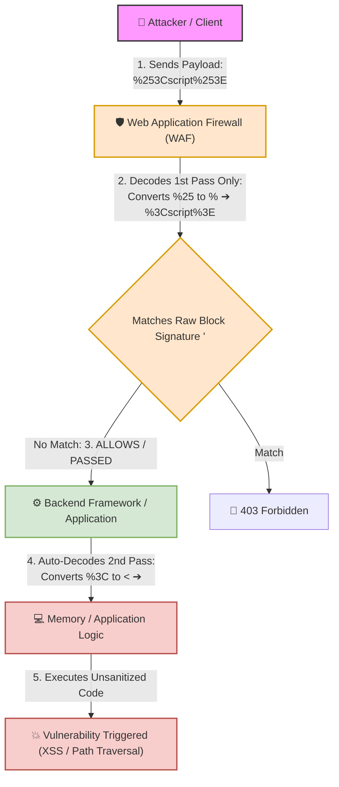

# 🌐 Lab 15: Double Encoding — The Dual-Bypass Technique for WAFs & Filters

## 📌 Overview

**Double Encoding** (or **Double URL Encoding**) is an evasion technique that hides malicious payloads by applying standard URL encoding twice consecutively. 

The cornerstone character of this technique is the percent symbol (`%`) itself. In the ASCII hexadecimal table, `%` is represented as hex `25`. Consequently, applying URL encoding to `%` produces `%25`. By replacing the `%` in a single-encoded sequence with `%25`, security controls inspecting only raw or single-decoded inputs can be reliably bypassed.

---

## ⚙️ Mechanics of Double Encoding

### 1. Step-by-Step Conversion Example (`<`)
* **Original Character:** `<`
* **Single Encoding (1st Pass):** Converts `<` into `%3C`
* **Double Encoding (2nd Pass):** Replaces `%` inside `%3C` with `%25`, yielding `%253C`

---

## 📊 Quick Reference Table: Common Double Encodings

| Original Character | Single URL Encoding | Double URL Encoding | Target Vulnerability Context |
| :---: | :---: | :---: | :--- |
| `<` | `%3C` | `%253C` | Tag opening for Cross-Site Scripting (XSS). |
| `>` | `%3E` | `%253E` | Tag closing for XSS payloads. |
| `'` *(Single Quote)* | `%27` | `%2527` | SQL injection and HTML attribute breakout. |
| `/` *(Slash)* | `%2F` | `%252F` | Directory/Path Traversal boundary breaking. |
| `..` *(Dot-Dot)* | `%2E%2E` | `%252E%252E` | Directory Traversal parent directory navigation. |

---

## 🛠️ Filter & WAF Bypass Dynamics (Decoding Asymmetry)

A double encoding bypass relies on a structural flaw known as **Decoding Asymmetry** between the security inspection layer (WAF) and the application processing engine (Backend).

### 🔍 Execution Pipeline Failure Breakdown:
1. **WAF Layer Inspection:** The WAF receives `%253Cscript%253E` and executes a single URL-decoding pass, converting `%25` into `%`. The resulting string evaluated by the WAF rules is `%3Cscript%3E`. Assuming the signature rule strictly looks for literal `<script>` or single-encoded forms, it misinterprets `%3C` as benign data and passes the request.
2. **Backend Engine Execution:** The backend framework or custom code receives `%3Cscript%3E`. If the environment performs an automatic parameter decoding step (e.g., framework web server layer) and the application code subsequently calls a manual decoding function (e.g., `urldecode()` in PHP), a second decoding pass occurs. `%3C` transforms into `<`.
3. **Exploitation:** The literal payload `<script>` reaches execution memory without prior sanitization.

> [!IMPORTANT]
> **Root Security Issue:**  
> Double decoding vulnerabilities frequently occur when web application frameworks automatically decode input parameters once, and developers inadvertently invoke additional decoding helper functions within their business logic.

---

## 🧪 Practical Scenarios, Questions & Technical Evaluations

### 🔹 Field Scenario: Directory Traversal WAF Bypass via Double Encoding

> [!CAUTION]
> **Field Condition:**  
> You are auditing a file download endpoint using a URL path parameter:  
> `https://target.com/download?file=about.pdf`  
>
> 1. You attempt to access sensitive system files with raw path traversal sequences:  
>    `../etc/passwd`  
>    **Result:** The WAF blocks the request with `403 Forbidden` due to `..` and `/` signatures.
> 2. You re-submit using single URL encoding:  
>    `%2e%2e%2fetc%2fpasswd`  
>    **Result:** The WAF still intercepts and responds with `403 Forbidden`.
> 3. You submit using double URL encoding:  
>    `%252e%252e%252fetc%252fpasswd`  
>    **Result:** The WAF permits the request (`HTTP 200 OK`), and the server renders the contents of `/etc/passwd`.

* **Questions:**
  1. How was the `/` character transformed into `%252f` using double encoding?
  2. Why did the WAF fail to block the request when double encoding was applied, despite successfully catching single encoding?

---

* **Student Analysis:**
  > **1. Character Transformation:** The original `/` character single-encodes to `%2F`. By encoding the `%` symbol into `%25`, the final sequence becomes `%252f`.  
  > **2. WAF Bypass Root Cause:** The WAF detected `%2f` in single encoding and blocked it. In double encoding (`%252f`), the WAF performed only one decoding pass, converting it to `%2f`. Because its signature set did not explicitly flag `%2f` (expecting a literal `/` after full normalization), it allowed the request. The backend then executed a second decoding pass, converting `%2f` into `/` and retrieving the file.

---

* **Technical Security Breakdown & Evaluation:**
  * **Verdict:** ✅ **100% Accurate Assessment.**
  * **Transformation Breakdown (Question 1):**  
    ` / ` (Literal) ➔ `%2F` (Single Encoding) ➔ `%252F` / `%252f` (Double Encoding via `%` ➔ `%25`).
  * **Architectural Failure Mechanics (Question 2):**  
    The security failure stems from **Incomplete Normalization on the Inspection Gateway**. 
    * The WAF inspected `%252fetc%252fpasswd` and ran a single-pass URL decode routine, producing `%2fetc%2fpasswd`.
    * Because the WAF's signature engine was configured to look for literal `/etc/passwd` or failed to recursively normalize encoded strings, it evaluated `%2f` as an arbitrary text parameter rather than a directory delimiter.
    * The application backend subsequently received `%2fetc%2fpasswd`, decoded it a second time into `/etc/passwd`, and passed it to the file system API without input validation, granting access to system files.
