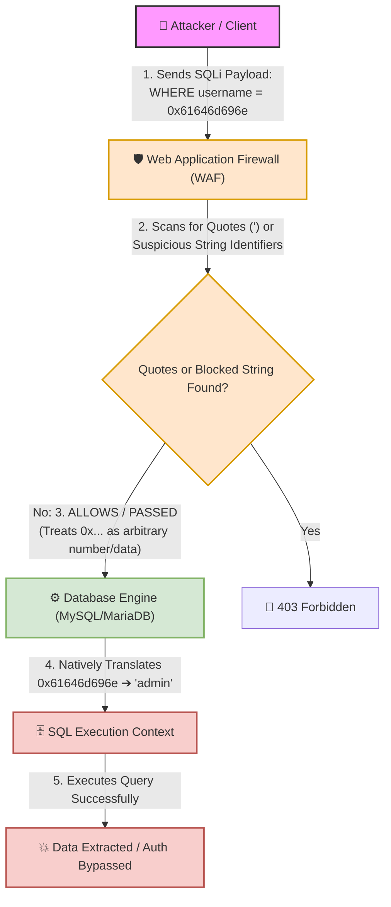

# 🌐 Lab 16: Hex Encoding (0x41) — Direct Database Pass-Through & SQLi String Breaking


## 📌 Overview

**Hexadecimal Encoding** (Base-16) represents data using 16 distinct symbols: numbers `0-9` and letters `A-F` (or `a-f`). In computer systems and databases, hex representation is widely used for binary data handling and string literal encoding.

In the context of **SQL Injection (SQLi)** vulnerabilities, security filters and Web Application Firewalls (WAFs) heavily rely on detecting string delimiters such as single quotes (`'`) or double quotes (`"`). Hex encoding allows attackers to pass raw string data directly to the database engine using the `0x` prefix, completely bypassing quote-based signature detection.

---

## ⚙️ Mechanics of Hex Encoding in SQL Engines

### 1. The Quote-Less Literal Concept
Database engines (such as MySQL and MariaDB) natively interpret any sequence preceded by `0x` as a hexadecimal string literal. The database automatically parses the hex stream into its ASCII/binary equivalent **without requiring string quotes**.

* **Standard SQL Query (Requires Quotes):**
  ```sql
  SELECT * FROM users WHERE username = 'admin';
  ```
* **Hex-Encoded SQL Query (Zero Quotes Required):**
  ```sql
  SELECT * FROM users WHERE username = 0x61646d696e;
  ```

---

## 📊 Quick Reference Table: ASCII to Hex Conversions

| Original Character / String | Hexadecimal Values (Hex) | SQL Hex Representation | Security & Abuse Context |
| :---: | :---: | :---: | :--- |
| `A` | `41` | `0x41` | Upper-case letter representation. |
| `a` | `61` | `0x61` | Lower-case letter representation. |
| `'` *(Single Quote)* | `27` | `0x27` | Breaking SQL string boundaries without literal `'`. |
| `admin` | `61 64 6d 69 6e` | `0x61646d696e` | Bypassing string-matching filters for `admin`. |
| `root` | `72 6f 6f 74` | `0x726f6f74` | Bypassing user lookup signature filters. |

---

## 🛠️ Filter & WAF Bypass Dynamics (Hex Pass-Through)

Security controls fail when they search for quote delimiters or literal strings while the backend database engine natively evaluates hexadecimal constants.



### 🔍 Execution Pipeline Failure Breakdown:
1. **WAF Layer Inspection:** The WAF receives `0x61646d696e`. It inspects the payload for single quotes (`'`), string concatenation routines, or blacklisted keywords in quotes. Since no single quotes exist in `0x61646d696e`, the WAF treats it as a benign hexadecimal constant or numeric value and passes the request.
2. **Database Parsing:** The MySQL/MariaDB parser encounters `0x61646d696e` and automatically decodes the hex bytes into the ASCII string `'admin'` during query evaluation.
3. **Exploitation:** The SQL query executes cleanly without triggering signature alerts.

---

## 🧪 Practical Scenarios, Questions & Technical Evaluations

### 🔹 Field Scenario: Database Schema Enumeration WAF Bypass via Hex Encoding

> [!CAUTION]
> **Field Condition:**  
> You are testing a SQL Injection vulnerability in a database search parameter. You attempt to extract table names from a specific database schema using the following query:  
> ```sql
> UNION SELECT 1, table_name FROM information_schema.tables WHERE table_schema = 'users_db'
> ```  
> **Result:** The WAF intercepts the request and responds with `403 Forbidden` due to the explicit single quotes surrounding `'users_db'`.

* **Questions:**
  1. How can you convert the string `'users_db'` into a direct Hex representation to bypass quote inspection? *(Hint: ASCII Hex values: `u=75`, `s=73`, `e=65`, `r=72`, `_=5f`, `d=64`, `b=62`)*
  2. What is the final, fully-formed SQL query that will bypass the WAF and execute successfully inside the database?

---

* **Student Analysis:**
  > **1. Hex String Conversion:** Converting each character sequentially (`75 73 65 72 73 5f 64 62`) and prefixing with `0x` yields:  
  > `0x75736572735f6462`  
  > **2. Final Bypassing Query:**  
  > ```sql
  > UNION SELECT 1, table_name FROM information_schema.tables WHERE table_schema = 0x75736572735f6462
  > ```

---

* **Technical Security Breakdown & Evaluation:**
  * **Verdict:** ✅ **100% Accurate Assessment.**
  * **Hex Value Verification (Question 1):**  
    `u` (75) + `s` (73) + `e` (65) + `r` (72) + `s` (73) + `_` (5f) + `d` (64) + `b` (62) ➔ `0x75736572735f6462`.
  * **Architectural Execution Mechanics (Question 2):**  
    By replacing `'users_db'` with `0x75736572735f6462`, all single quote characters (`'`) are removed from the input. The WAF fails to recognize `'users_db'` in the stream and allows the request through. The database engine parses `0x75736572735f6462` natively as the string `'users_db'` and executes the schema lookup query without syntax errors.
