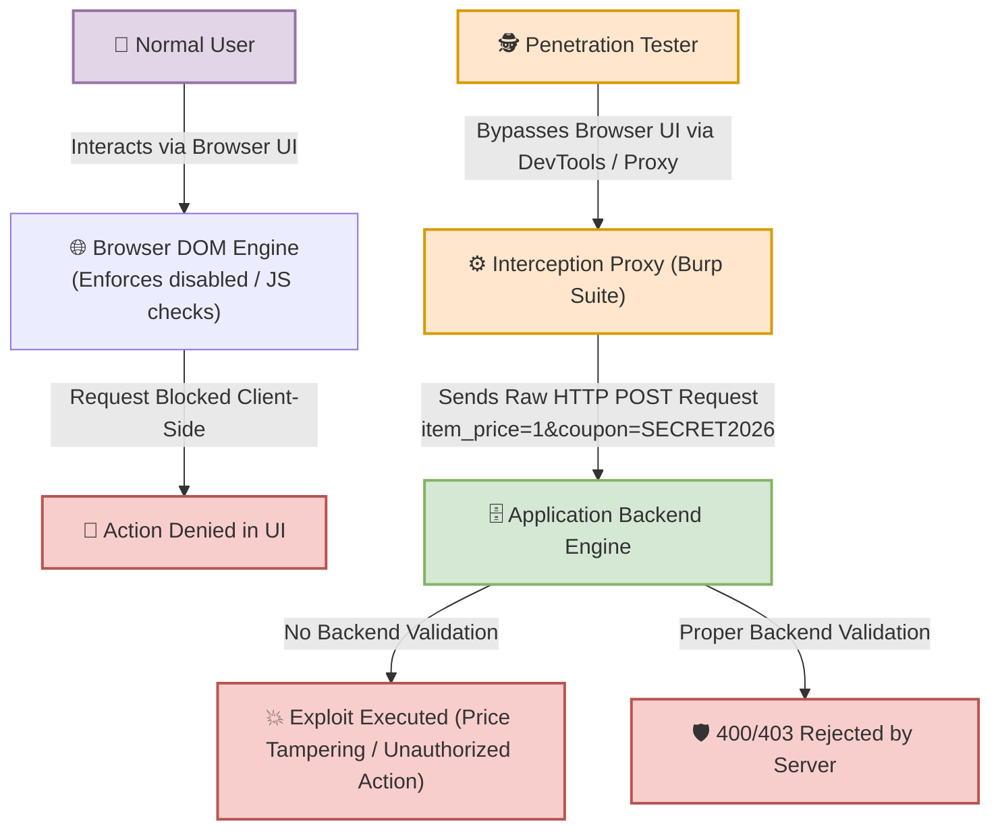

# 🌐 Lab 18: Web Technologies — HTML & JavaScript Reconnaissance for Pentesters


## 📌 Overview

Penetration testers do not need to build complex front-end applications; their objective is to **read, deconstruct, and analyze client-side code** rendered in the browser (via Browser DevTools `F12` or View Source). 

Client-side code (HTML, CSS, JavaScript) executes entirely within the user's environment. Because the client has full control over the browser execution context, **client-side controls can never be relied upon as security boundaries**.

---

## ⚙️ Mechanics of Client-Side Code Reconnaissance

### 1. High-Value Targets in HTML Structure
* **Hidden Form Inputs (`<input type="hidden">`):** Often used by developers to store state data, user IDs, or transaction prices. These values can be modified prior to request submission.
* **UI Constraints (`disabled`, `readonly`, `maxlength`):** Enforce input rules in the browser UI. They can be removed instantly via DOM manipulation or completely bypassed using interception proxies.
* **External Script Sources (`<script src="...">`):** JavaScript bundles that may contain hardcoded API keys, internal staging links, or undocumented administrative endpoints.

### 2. High-Value Targets in JavaScript Logic
* **Client-Side Validation Routines:** File extension checks or regex filters that block requests in the browser before transmission to the server.
* **Hidden API Endpoints:** Internal routing calls (e.g., `fetch('/api/v1/...')` or `axios.post('/admin/delete')`) that expose unlinked application functionality.
* **DOM-based XSS Sinks:** Insecure data flows where user-controlled sources write directly into executable DOM properties (e.g., `element.innerHTML = location.hash`).

---

## 🛠️ Execution Pipeline: Browser Controls vs. Proxy Interception



---

## 📊 Mindset Breakdown: Normal User vs. Penetration Tester

| Metric | Normal User Perspective | Penetration Tester Perspective | Server-Side Reality |
| :--- | :--- | :--- | :--- |
| **Interface Control** | Constrained by buttons, forms, and UI states. | Treats browser UI as an optional display layer. | Sees only incoming raw HTTP network requests. |
| **`disabled` Attribute** | Accepts element as unclickable. | Removes attribute via DOM or crafts HTTP request directly. | Unaware of DOM attributes; evaluates only POST parameters. |
| **Client-Side JS Check** | Blocked if validation fails. | Disables JS execution or intercepts payload in Burp Suite. | Must re-validate all inputs independently on the backend. |

---

## 🧪 Practical Scenarios, Questions & Technical Evaluations

### 🔹 Field Scenario: E-Commerce Checkout Form Analysis

> [!CAUTION]
> **Field Condition:**  
> During an assessment of an e-commerce checkout page, you locate the following HTML and JavaScript source code:  
>
> ```html
> <form action="/checkout.php" method="POST">
>    <input type="hidden" name="item_price" value="250">
>    <input type="text" name="coupon" id="coupon_input">
>    <button type="submit" id="pay_btn" disabled>Complete Purchase</button>
> </form>
> 
> <script>
>    function validateCoupon() {
>        let code = document.getElementById("coupon_input").value;
>        if (code === "SECRET2026") {
>            document.getElementById("pay_btn").disabled = false;
>        }
>    }
> </script>
> ```

* **Questions:**
  1. What sensitive data is stored in the hidden field, and how can it be manipulated?
  2. Identify two distinct security flaws where the developer relied on client-side controls, and describe how each can be bypassed.

---

* **Student Analysis:**
  > **1. Hidden Field Vulnerability:** The item price (`250`) is stored inside a hidden input field (`item_price`). An attacker can modify this value (e.g., change `250` to `1`) to execute a price tampering attack.  
  > **2. Security Flaws Identified:**
  > * **Hardcoded Secret:** The coupon code `SECRET2026` is written directly in client-side JavaScript, allowing anyone to inspect the source code and retrieve it.
  > * **Client-Side UI Restrictions:** The `pay_btn` relies on the `disabled` attribute for access control, which can be removed via DevTools or completely ignored by submitting a direct HTTP POST request.

---

* **Technical Security Breakdown & Evaluation:**
  * **Verdict:** ✅ **100% Accurate Security Assessment.**
  * **Flaw #1: Business Logic Vulnerability (Parameter Tampering):**  
    Storing order pricing in client-side form parameters violates core security principles. The golden rule of secure application design is: *Never trust parameters supplied by the client*. The backend server must query the database internally for item prices based on a secure product ID.
  * **Flaw #2: Hardcoded Sensitive Information:**  
    Client-side JavaScript code is fully public. Embedding secrets, API keys, or validation tokens directly in client scripts renders those credentials publicly accessible.
  * **Flaw #3: Reliance on Client-Side Access Control:**  
    The backend endpoint `/checkout.php` receives raw HTTP requests. Bypassing UI elements does not require interacting with the browser interface; an attacker can transmit a crafted HTTP POST request directly using tools like Burp Suite or `curl`.

---

## 📝 Raw HTTP Request Interception Example (Burp Suite)

An attacker bypassing the browser UI entirely transmits the following HTTP payload directly to the server:

```http
POST /checkout.php HTTP/1.1
Host: target.com
User-Agent: Mozilla/5.0 (Windows NT 10.0; Win64; x64)
Content-Type: application/x-www-form-urlencoded
Content-Length: 32

item_price=1&coupon=SECRET2026
```

> [!IMPORTANT]
> **Key Security Takeaway:**  
> Controls implemented via HTML, CSS, and JavaScript are designed exclusively for **User Experience (UX)** and offer **zero security boundary enforcement**. Security validation must always occur server-side (Backend Verification).

---
