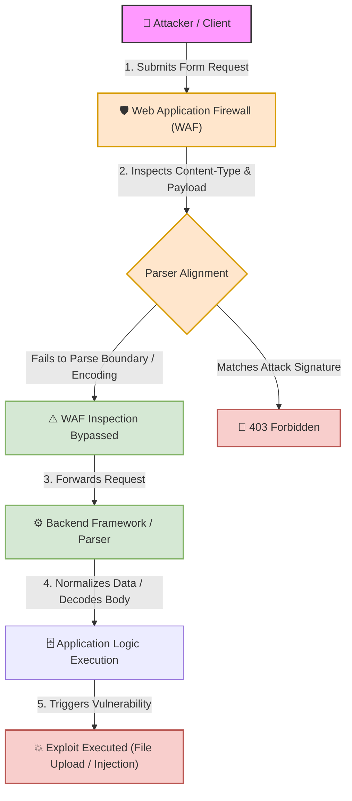

# 🌐 Lab 19: Web Technologies — HTML Forms & Data Transmission Mechanics (GET vs POST & Enctype)


## 📌 Overview

**HTML Forms** serve as the primary interactive bridge between users and web application backends. They handle critical user-driven data flows, including authentication, search queries, data updates, and file uploads.

For penetration testers, understanding how form elements package data into HTTP requests—and how backend parsers process various content types—is fundamental to uncovering vulnerabilities such as **Cross-Site Request Forgery (CSRF)**, **Unrestricted File Uploads**, **Command Injection**, **SQL Injection**, and **WAF Evasion via Parser Differentials**.

---

## ⚙️ Core Components of HTML Forms

A standard HTML form is instantiated via the `<form>` tag. Three essential attributes govern how user inputs are transmitted across the network:

```html
<form action="/login.php" method="POST" enctype="application/x-www-form-urlencoded">
    <input type="text" name="username">
    <input type="password" name="password">
    <button type="submit">Log In</button>
</form>
```

* **`action`**: The target server-side endpoint URI that processes the submitted data.
* **`method`**: The HTTP method used for transmission (typically `GET` or `POST`).
* **`enctype`**: The encoding scheme used to package input key-value pairs inside the HTTP request body.

> [!NOTE]
> **Attribute vs. Header Distinction:**  
> `enctype` is an **HTML form attribute**, whereas `Content-Type` is the resulting **HTTP request header** sent to the server. Note that `application/json` is a standard API content type, but it is not a native HTML form `enctype` value in standard HTML specs.

---

## 📊 Transmission Methods: GET vs. POST Comparison

| Comparison Metric | `GET` Method | `POST` Method |
| :--- | :--- | :--- |
| **Data Placement** | Appended to URI as Query Parameters (`?key=value`). | Encapsulated within the HTTP Request Body. |
| **Network Request Sample** | `GET /search?q=admin HTTP/1.1` | `POST /login HTTP/1.1` (Body: `user=admin`) |
| **Security Risks** | ⚠️ **Sensitive Data Exposure:** Parameters log in Browser History, Web Server Access Logs (`access.log`), proxy logs, and the `Referer` HTTP header when navigating externally. | ⚠️ **No Default Encryption:** Hidden from the URL string, but transmitted in cleartext unless protected by TLS/HTTPS. |
| **Primary Use Case** | Idempotent data retrieval (e.g., search queries, pagination). | State-changing or sensitive operations (e.g., login, password reset, payments). |

---

## 🛠️ Content-Type / Enctype Deep Dive & Pentesting Vectors

### 1. `application/x-www-form-urlencoded`
This is the default encoding scheme for HTML forms using `method="POST"` if no `enctype` is specified.

* **Formatting Rules:** Key-value pairs are formatted as `key=value`, concatenated with `&`, and URL-encoded. Spaces are typically converted to `+` (or `%20`).
* **Raw HTTP Request Example:**
  ```http
  POST /submit.php HTTP/1.1
  Host: target.com
  Content-Type: application/x-www-form-urlencoded
  Content-Length: 63

  username=admin%27+OR+1%3D1--&email=test%40example.com
  ```
* **Security & Pentesting Vectors:**
  * **Primary Targets:** SQL Injection, Command Injection, XSS, HTTP Parameter Pollution (HPP).
  * **Parser Differential:** WAFs inspect the raw URL-encoded string, while the backend automatically decodes parameters. Discrepancies in double-decoding or encoding handling can lead to security bypasses.
  * **Limitations:** Inefficient for binary data or large file transmissions due to encoding overhead.

---

### 2. `multipart/form-data`
Designed specifically to handle binary file uploads alongside structured form inputs.

* **Formatting Rules:** Divides the request body into distinct parts separated by a unique `boundary` string declared in the `Content-Type` header. Each part maintains its own internal sub-headers (`Content-Disposition`, `Content-Type`).
* **Raw HTTP Request Example:**
  ```http
  POST /upload.php HTTP/1.1
  Host: target.com
  Content-Type: multipart/form-data; boundary=----WebKitFormBoundaryABC123
  Content-Length: 324

  ------WebKitFormBoundaryABC123
  Content-Disposition: form-data; name="username"

  ahmed
  ------WebKitFormBoundaryABC123
  Content-Disposition: form-data; name="avatar"; filename="shell.php"
  Content-Type: image/jpeg

  <?php system($_GET['cmd']); ?>
  ------WebKitFormBoundaryABC123--
  ```
* **Security & Pentesting Vectors:**
  * **Unrestricted File Uploads:** Modifying `filename` (e.g., to `.php`, `.jsp`, `.exe`) or spoofing the sub-header `Content-Type: image/jpeg` to bypass client-side MIME checks.
  * **WAF Boundary Manipulation:** Altering boundary formatting, line breaks, or whitespace can cause WAF inspection routines to miss malicious parts while the backend parser still processes them cleanly.

---

### 3. `text/plain`
Transmits input fields as unencoded raw text, separated by plain newlines (`\n`).

* **Formatting Rules:** Lacks URL encoding (`%XX`). Special characters, spaces, and line breaks are transmitted raw.
* **Raw HTTP Request Example:**
  ```http
  POST /feedback.php HTTP/1.1
  Host: target.com
  Content-Type: text/plain
  Content-Length: 35

  username=ahmed
  comment=hello world
  ```
* **Security & Pentesting Vectors:**
  * **CSRF Exploitability:** Browsers treat `text/plain` as a "Simple Request" under CORS guidelines, allowing cross-site form submissions without triggering preflight `OPTIONS` checks.
  * **Log Injection:** Transmitting raw newline characters (`\r\n`) can allow attackers to inject fake entries into plain-text server log files.

---

## 🔍 Architectural Execution & Parser Differentials



---

## 🧪 Practical Scenarios, Questions & Technical Evaluations

### 🔹 Field Scenario: Password Reset & Profile Picture Upload Form Assessment

> [!CAUTION]
> **Field Condition:**  
> During a web application audit, you encounter two distinct form implementations:
>
> **Form 1 (Password Update):**
> ```html
> <form action="/update_password.php" method="GET">
>     <input type="password" name="new_pass">
>     <button type="submit">Change Password</button>
> </form>
> ```
>
> **Form 2 (Avatar Upload):**
> A form designed to allow users to update their profile picture by uploading an image file to `/upload_avatar.php`.

* **Questions:**
  1. What is the security vulnerability associated with using `method="GET"` in Form 1 for handling sensitive user credentials?
  2. What explicit `enctype` value must be configured in Form 2 to enable binary image file transmission?

---

* **Student Analysis:**
  > **1. Form 1 Vulnerability:** Using `method="GET"` exposes the password inside the URL query parameter (`/update_password.php?new_pass=secret`). This causes the cleartext password to leak in browser history, proxy logs, server access logs (`access.log`), and external `Referer` headers.  
  > **2. Form 2 Configuration:** To upload binary files, the form must explicitly set the attribute `enctype="multipart/form-data"`.

---

* **Technical Security Breakdown & Evaluation:**
  * **Verdict:** ✅ **100% Accurate Security Assessment.**
  * **GET Method Exposure Analysis (Question 1):**  
    Passing sensitive parameters via `GET` violates sensitive data exposure standards. Even if TLS encryption protects the request in transit, the URL string remains stored in cleartext across multiple locations:
    1. **Browser Address Bar & History.**
    2. **Web Server Access Logs** (e.g., Nginx `access.log`, Apache `access_log`).
    3. **SIEM / Proxy Logs.**
    4. **`Referer` Headers** transmitted if the page loads external third-party assets.
  * **Enctype Configuration Analysis (Question 2):**  
    Setting `enctype="multipart/form-data"` forces the browser to construct a multi-part body with `boundary` delimiters, enabling binary data stream handling. Without this attribute, the browser defaults to `application/x-www-form-urlencoded`, transmitting only the file's text filename rather than its binary content.

---

