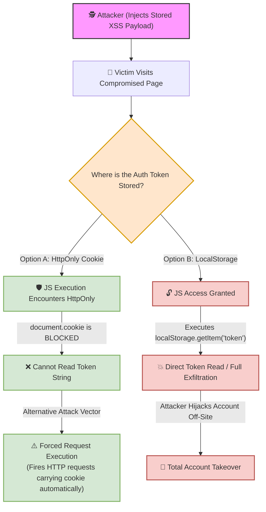

# 🌐 Lab 21: Session Management & Client-Side Storage — Cookies, Web Storage & Security Flags


## 📌 Overview

**Session management** maintains state across inherently stateless HTTP requests. Web applications store session tokens and authentication states using **Cookies** or **Web Storage APIs** (`LocalStorage` and `SessionStorage`).

For penetration testers, understanding where authentication data resides—and how security flags (`HttpOnly`, `Secure`, `SameSite`) are enforced—is critical for determining the operational impact of **Cross-Site Scripting (XSS)** and **Cross-Site Request Forgery (CSRF)** vulnerabilities.

---

## ⚙️ Core Storage Mechanisms & Security Flags

### 1. HTTP Cookies
Small text files generated by the server via the `Set-Cookie` header and automatically attached by the browser to subsequent HTTP requests matching the specified domain and path.

* **Security Flags:**
  * `HttpOnly`: Prevents client-side scripts from accessing the cookie via `document.cookie`. Primary defense against session hijacking via XSS.
  * `Secure`: Restricts cookie transmission exclusively to encrypted HTTPS connections.
  * `SameSite`: Controls cross-site cookie transmission to mitigate CSRF:
    * `Strict`: Never sends the cookie in cross-site requests.
    * `Lax`: Sends the cookie only with top-level cross-site navigations (e.g., clicking a link).
    * `None`: Sends the cookie in all cross-site contexts (requires `Secure` flag).
  * `Domain` / `Path`: Restricts cookie scope to specific domains, subdomains, or URI paths.

### 2. Server-Side Sessions
Sensitive user data (roles, permissions, shopping cart) resides in server memory or databases (e.g., Redis). The client receives only a cryptographically secure, random **Session ID** stored inside an HTTP cookie. Logging out invalidates the Session ID on the server, rendering any leaked client-side cookie useless.

### 3. LocalStorage
A persistent Web Storage API holding key-value pairs (5MB–10MB limit).
* **Persistence:** Permanent. Retained after closing the browser or rebooting the system until explicitly cleared via JavaScript (`localStorage.clear()`) or manual user action.
* **Security Profile:** No `HttpOnly` protection equivalent exists. Fully readable and writable by any JavaScript running within the same origin. Inherently vulnerable to token exfiltration via XSS.

### 4. SessionStorage
Identical to `LocalStorage` in API structure and capacity limits, but scoped strictly to the **current browser tab**.
* **Persistence:** Temporary. Wiped automatically when the specific browser tab is closed.
* **Security Profile:** Accessible to any JavaScript executing in the active tab context, rendering it equally vulnerable to XSS exfiltration during the active session.

---

## 📊 Client-Side Storage Comparison Matrix

| Storage Type | Lifetime / Persistence | Automatic HTTP Transmission | JS Accessible | Security Flags Supported | XSS Exfiltration Vulnerability |
| :--- | :--- | :--- | :--- | :--- | :--- |
| **HttpOnly Cookie** | Configured via `Expires`/`Max-Age` | ✅ Yes (Automatic) | ❌ No (`document.cookie` blocked) | `HttpOnly`, `Secure`, `SameSite` | 🛡️ Immune to direct token read (Vulnerable to Forced Requests) |
| **Standard Cookie** | Configured via `Expires`/`Max-Age` | ✅ Yes (Automatic) | ✅ Yes (`document.cookie`) | `Secure`, `SameSite` | ⚠️ High (Token readable via JS) |
| **LocalStorage** | Permanent until manually cleared | ❌ No (Requires JS code) | ✅ Yes (`localStorage.getItem()`) | None | 💥 Critical (Full payload exfiltration) |
| **SessionStorage**| Tab lifespan only | ❌ No (Requires JS code) | ✅ Yes (`sessionStorage.getItem()`) | None | 💥 Critical (Exfiltration during active tab) |

---

## 🛠️ Execution Pipeline: Stored XSS Impact Comparison



---

## 🧪 Practical Scenarios, Questions & Technical Evaluations

### 🔹 Field Scenario: Stored XSS Exploitation against Authentication Storage

> [!CAUTION]
> **Field Condition:**  
> During an audit of a web application, you uncover a **Stored XSS** vulnerability that allows executing arbitrary JavaScript in the browser context of visiting users. The application relies on a bearer authentication token.

* **Questions:**
  1. If the target application stores the authentication token inside an **`HttpOnly` Cookie**, can an attacker extract the literal token string using JavaScript (`document.cookie`)? What attack vector remains viable?
  2. If the token is stored inside **`LocalStorage`**, how does this impact the overall severity of the XSS vulnerability? What JavaScript command extracts a specific key or dumps the entire storage contents?

---

* **Student Analysis:**
  > **1. HttpOnly Cookie Scenario:** The attacker **cannot** read the raw token string because the browser blocks JavaScript access to `HttpOnly` cookies. However, the attacker can execute a *Forced Request via XSS* (XSS-driven CSRF), sending unauthorized background HTTP requests where the browser automatically attaches the cookie.  
  > **2. LocalStorage Scenario:** Storing tokens in `LocalStorage` escalates the XSS impact to **Critical**. The attacker can exfiltrate the raw token directly using `localStorage.getItem('auth_token')`. Alternatively, the entire contents of `LocalStorage` can be dumped using `JSON.stringify(localStorage)`.

---

* **Technical Security Breakdown & Evaluation:**
  * **Verdict:** ✅ **100% Accurate Security Assessment.**
  * **HttpOnly Defense Dynamics (Question 1):**  
    The `HttpOnly` flag successfully mitigates **direct token theft** via script execution. However, because cookies are automatically attached by the browser to origin requests, XSS enables **XSS-driven request forgery**. The injected script can invoke `fetch()` or `XMLHttpRequest` to perform unauthorized actions (e.g., modifying email addresses) on behalf of the victim without needing to read the cookie string.
  * **LocalStorage Risk Escalation (Question 2):**  
    `LocalStorage` lacks contextual protection flags. Upon acquiring XSS execution, extracting authentication tokens requires a single line of JavaScript:
    ```javascript
    // Target specific key
    const token = localStorage.getItem('auth_token');

    // Dump all stored origin data instantly
    const fullStorageDump = JSON.stringify(localStorage);
    ```
    Once exfiltrated off-site, the attacker can reuse the token independently on any client device until expiration, resulting in full session hijacking.
