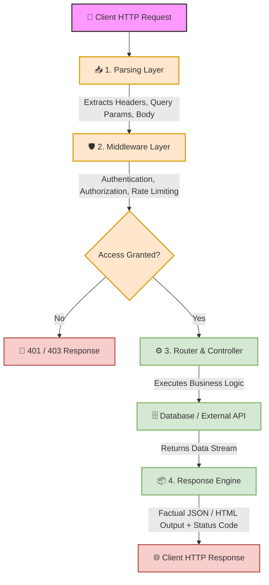

# 🌐 Lab 22: Backend Architecture, Request Lifecycles & Server-Side Vulnerabilities


## 📌 Overview

The **Backend** is the server-side processing engine responsible for handling HTTP requests from clients, executing Business Logic, managing database transactions, and returning structured HTTP responses (JSON, HTML, XML).

From a penetration testing perspective, understanding how different backend environments handle execution lifecycles, memory management, and input parsing is essential to uncovering critical server-side vulnerabilities such as **Remote Code Execution (RCE)**, **Template Injection (SSTI)**, **Deserialization Flaws**, and **Application-level Denial of Service (DoS)**.

---

## ⚙️ Backend Environments & Execution Models

Different programming paradigms handle incoming HTTP requests using distinct execution and memory management models:

| Environment | Architecture & Execution Model | Fault Isolation Level | Primary Security Risks |
| :--- | :--- | :--- | :--- |
| **PHP** | **Isolated Per-Request Script Execution:** Executes top-to-bottom per request, flushes memory completely upon completion. | 🟢 **High Isolation:** Script crashes affect only the current user's request thread. | LFI/RFI, Code Injection (`eval`), Direct Command Execution (`system`), Deserialization. |
| **Python** *(Django / Flask)* | **Persistent In-Memory Execution:** Runs continuously inside application servers (Gunicorn/UVICORN/WSGI). Processes requests dynamically via routing layers. | 🟡 **Moderate:** Application remains loaded in memory across multiple client requests. | Server-Side Template Injection (SSTI - Jinja2), Insecure Pickle Deserialization. |
| **Node.js** *(Express)* | **Single-Threaded Event Loop:** Single non-blocking event-driven process managing all asynchronous concurrent requests. | 🔴 **Zero Isolation:** Unhandled exceptions can crash the entire backend process for all users. | Prototype Pollution, Event Loop Blocking DoS, Unhandled Exception Crashing. |

> [!NOTE]
> **The Restaurant Analogy (PHP vs. Node.js Architecture):**
> * **PHP (Independent Chefs Model):** Each client request receives an isolated worker process. If a client triggers a fatal script error, only that specific worker terminates. The rest of the site remains operational for all other users.
> * **Node.js (Single Super-Fast Chef Model):** A single event-driven process serves all incoming requests concurrently. If an attacker submits a payload that raises an **Unhandled Exception**, the single active process crashes, shutting down the entire web application instantly for all users (**DoS**).

---

## 🔄 The Request Lifecycle (Request to Response)

When an HTTP request strikes a web application server, it passes through a multi-tiered pipeline:



### Key Technical Terminology
* **`Parsing`**: The process of translating raw incoming HTTP request strings into structured objects (e.g., JSON to native language dictionaries).
* **`Middleware`**: Intermediate inspection layers enforcing security rules (Authentication, Input Validation, CSRF Checks, Rate Limiting).
* **`Authentication (AuthN)`**: Verifying *who* the user is (e.g., checking tokens/passwords).
* **`Authorization (AuthZ)`**: Verifying *what* resources the authenticated user is allowed to access.
* **`Controller / Business Logic`**: Core application logic performing operations and data transformations.

---

## 🛠️ Top 10 Server-Side Vulnerability Vectors

### 1. File Inclusion (LFI / RFI)
* **Mechanism:** Unsanitized user input passed directly into file loading functions.
* **Vulnerable Code (PHP):**
  ```php
  include($_GET['page']);
  ```
* **Security Risk:** Local File Inclusion (LFI) allows reading sensitive configuration files (`/etc/passwd`, `web.config`), while Remote File Inclusion (RFI) enables remote code execution.
* **Remediation:** Implement strict input allowlisting instead of direct dynamic pathing.

---

### 2. Code Injection
* **Mechanism:** User input directly evaluated by the programming language interpreter.
* **Vulnerable Code (PHP):**
  ```php
  eval($_GET['code']);
  ```
* **Security Risk:** Direct Arbitrary Code Execution within the backend runtime context.
* **Remediation:** Avoid dynamic code evaluation functions (`eval`, `exec`).

---

### 3. Command Injection
* **Mechanism:** Input concatenated into system shell commands.
* **Vulnerable Code (PHP):**
  ```php
  system("ping " . $_GET['host']);
  ```
* **Security Risk:** Allows attackers to execute arbitrary Operating System commands using shell command chaining operators (`&&`, `;`, `|`).
* **Remediation:** Use native non-shell execution APIs with parameterized arguments.

---

### 4. SQL Injection (SQLi)
* **Mechanism:** Concatenating unsanitized inputs into raw SQL query statements.
* **Vulnerable Code (PHP):**
  ```php
  $query = "SELECT * FROM users WHERE id = " . $_GET['id'];
  ```
* **Security Risk:** Data exfiltration, authentication bypass, database destruction, and potential OS command shell access (`xp_cmdshell`, `SELECT INTO OUTFILE`).
* **Remediation:** Enforce Parameterized Queries / Prepared Statements exclusively.

---

### 5. Server-Side Template Injection (SSTI)
* **Mechanism:** Injecting template engine syntax directly into template rendering engines (Jinja2, Twig, Smarty, EJS).
* **Vulnerable Code (Python/Flask):**
  ```python
  render_template_string("Hello " + user_input)
  ```
* **Detection Probe:** Submitting `{{7*7}}` results in output rendering `49`.
* **Security Risk:** Escaping the template sandbox leads to Remote Code Execution (RCE).
* **Remediation:** Pass variables safely into templates contextually: `render_template('page.html', name=user_input)`.

---

### 6. Insecure Deserialization
* **Mechanism:** Reconstructing serialized data objects from untrusted sources without validation.
* **Vulnerable Operations:** PHP `unserialize()`, Python `pickle.loads()`.
* **Security Risk:** Object injection leading to memory corruption, property manipulation, or arbitrary RCE payloads.
* **Remediation:** Avoid serializing complex objects from untrusted sources; rely on structured format standards like JSON.

---

### 7. Broken Access Control / IDOR
* **Mechanism:** The backend fails to verify user permissions (AuthZ) on target resource identifiers.
* **Vulnerable Scenario:** Changing request URI parameter `GET /user/25` to `GET /user/26` returns unauthorized user data.
* **Security Risk:** Horizontal and vertical privilege escalation.
* **Remediation:** Validate object-level ownership on every data access request at the server layer.

---

### 8. Prototype Pollution
* **Mechanism:** Unsafe recursive Object merging in JavaScript modifying the root `Object.prototype`.
* **Vulnerable Code (Node.js):**
  ```javascript
  merge(targetObject, JSON.parse(attackerPayload));
  ```
* **Security Risk:** Alters global property inheritance across all active JS objects, causing logic bypasses, Denial of Service, or RCE.
* **Remediation:** Freeze prototypes (`Object.freeze()`) and use Map datatypes for dynamic key-value operations.

---

### 9. Application-Level Denial of Service (DoS)
* **Mechanism:** Exhausting CPU, RAM, or Thread pools through computational overhead or synchronous infinite execution loops.
* **Vulnerable Code (Node.js):**
  ```javascript
  while (true) {} // Blocks the Event Loop completely
  ```
* **Security Risk:** Complete unavailability of backend resources for all concurrent application users.
* **Remediation:** Implement timeouts, asynchronous non-blocking logic, and background queue workers for heavy tasks.

---

### 10. Unhandled Exception Crashing
* **Mechanism:** Unexpected inputs raising unhandled runtime errors in backend environments lacking global exception catch handlers.
* **Vulnerable Pattern:** Node.js process failing to catch an asynchronous runtime error, causing immediate process termination.
* **Security Risk:** Application crash causing total denial of service.
* **Remediation:** Wrap dangerous logic in `try-catch` blocks and implement global process exception handlers.

---

## 🧪 Practical Scenarios, Questions & Technical Evaluations

### 🔹 Field Scenario: Server Crash & SSTI Prevalence Analysis

> [!CAUTION]
> **Field Condition:**  
> During an authorized web application penetration test, you submit a manually crafted, malformed payload into an input field. Immediately upon processing the request, the target application completely crashes and stops responding to all concurrent users across the platform (**Server Crash**).

* **Questions:**
  1. Based on backend memory management and request lifecycle execution models, which environment (**Node.js** or **PHP**) is most likely responsible for this behavior, and why?
  2. Why are **Server-Side Template Injection (SSTI)** vulnerabilities significantly more prevalent in modern environments like **Python** and **Node.js** compared to traditional PHP?

---

* **Student Analysis:**
  > **1. Target Environment Identification:** The most likely environment is **Node.js**. Node.js executes on a single-threaded event loop architecture where a single process handles all client connections. An unhandled exception triggered by a malformed request causes the main Node process to crash, bringing down the entire application for all users simultaneously.  
  > **2. SSTI Prevalence Mechanics:** Environments like Python (Flask/Django) and Node.js (Express) heavily decouple application logic from view presentation by relying on specialized **Template Engines** (e.g., Jinja2, EJS, Pug) to dynamically render HTML. SSTI occurs when developers improperly concatenate raw user input directly into template syntax instead of passing it as plain context data. Submitting payloads like `{{7*7}}` causes the backend template engine to execute dynamic expressions directly within the Python/Node.js runtime context, creating severe security vulnerabilities.

---

* **Technical Security Breakdown & Evaluation:**
  * **Verdict:** ✅ **100% Accurate Security Assessment.**
  * **Memory Management & DoS Impact (Question 1):**  
    * **Node.js:** Operates as a single persistent process (`Single Threaded Event Loop`). If an application error is uncaught by global middleware, the entire node process terminates (`process.exit`), resulting in an application-wide Denial of Service (DoS).
    * **PHP:** Employs a shared-nothing per-request lifecycle (`FPM/Apache Worker`). If a PHP script encounters a fatal error, only that specific worker process terminates; all other concurrent user threads continue functioning unaffected.
  * **Template Architecture Dynamics (Question 2):**  
    Traditional PHP natively integrates code rendering into HTML templates without requiring an abstraction layer (`<?php echo $var; ?>`). Conversely, modern web frameworks in Python and Node.js strictly mandate external rendering engines (Jinja2, Mako, Handlebars, EJS). When developers dynamically construct template strings (`render_template_string("Hello " + input)`), user input is elevated to template code syntax, enabling RCE.
