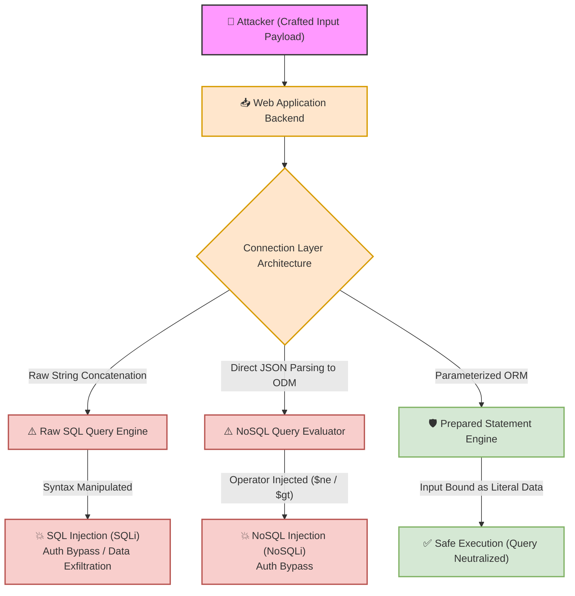

# 🌐 Lab 23: Database Architecture — SQL vs. NoSQL, Connection Layer Security & Injection Vectors


## 📌 Overview

**Databases** serve as the central persistent storage layer for web applications, holding sensitive user profiles, hashed credentials, financial transactions, and system configurations. 

From a penetration testing perspective, security auditing of database interactions focuses on analyzing how the backend connects to the data store (Raw Queries vs. ORM/ODM layers), identifying schema architectures (Relational SQL vs. Document NoSQL), and evaluating input handling to uncover **SQL Injection (SQLi)**, **NoSQL Injection (NoSQLi)**, and **Exposed Database Services**.

---

## ⚙️ Classification of Database Systems

Web application databases fall into two primary architectural paradigms:

| Metric / Feature | Relational Databases (SQL) | Non-Relational Databases (NoSQL) |
| :--- | :--- | :--- |
| **Popular Engines** | MySQL, PostgreSQL, SQLite, Microsoft SQL Server (MSSQL). | MongoDB, Redis, Apache Cassandra, CouchDB. |
| **Data Structure** | Strict Schema: Tables, Rows (Records), and Columns. | Flexible Schema: Documents (JSON/BSON), Key-Value pairs, Graphs. |
| **Query Language** | Structured Query Language (SQL). | Native API calls, JSON query objects, JavaScript execution engines. |
| **Primary Vulnerability Vector** | **SQL Injection (SQLi)** | **NoSQL Injection (NoSQLi)** |

---

## 🔄 Backend Connection Mechanics & Security Profiles

Backend application frameworks interface with databases using two distinct implementation approaches:

### 1. Raw SQL Queries (Handcrafted Query Strings)
* **Mechanics:** Developers construct SQL query statements by manually concatenating dynamic application strings.
* **Security Risk:** **Critical.** Concatenating unsanitized user inputs directly into query strings allows user input to break out of data context and alter SQL command syntax, directly causing **SQL Injection**.
* **Vulnerable Example (PHP):**
  ```php
  $query = "SELECT * FROM users WHERE username = '" . $_GET['user'] . "'";
  ```

### 2. Object-Relational / Document Mapping (ORM / ODM Layers)
* **Mechanics:** Abstraction layers (e.g., Django ORM, PHP Eloquent, Sequelize, Mongoose) map database entities directly to programming language objects.
* **Security Profile:** **High Default Protection.** ORMs automatically implement **Prepared Statements (Parameterized Queries)**, cleanly separating data inputs from code logic and neutralizing traditional SQLi.
* **Security Exception:** Passing unvalidated JSON objects directly into NoSQL ODMs (like Mongoose) can allow query operator injection (`$gt`, `$ne`).

---

## 🛠️ Execution Pipeline & Database Injection Vectors



### Key Security Testing Focus Areas
* **Authentication Bypasses:** Injecting boolean conditions (`' OR '1'='1` in SQL or `{"$ne": null}` in NoSQL) to force queries to return `TRUE`, bypassing password checks.
* **Exposed Service Ports:** Identifying database management ports exposed directly to the public internet without backend access controls or authentication requirements:
  * **MySQL:** Port `3306`
  * **PostgreSQL:** Port `5432`
  * **MongoDB:** Port `27017`
  * **Redis:** Port `6379`
* **Type-Juggling / Operator Abuse in NoSQL:** Supplying nested JSON objects containing comparison operators (`$gt`, `$ne`, `$regex`) when the application expects a simple string primitive.

---

## 🧪 Practical Scenarios, Questions & Technical Evaluations

### 🔹 Field Scenario: Authentication Bypass Audit

> [!CAUTION]
> **Field Condition:**  
> During an assessment of a REST API login endpoint (`POST /api/login`), the baseline JSON request is captured:
> ```json
> {
>   "username": "admin",
>   "password": "123"
> }
> ```
> 
> You modify the request body payload to inject a comparison operator:
> ```json
> {
>   "username": "admin",
>   "password": {"$ne": ""}
> }
> ```
> The server responds with `200 OK` and issues an administrative authentication token, successfully bypassing authentication without knowing the password.

* **Questions:**
  1. What type of database is processing this request based on the `$ne` (Not Equal) operator syntax, and what is the exact name of the discovered vulnerability?
  2. If the application instead relied on a traditional relational SQL database with raw query string concatenation, what equivalent classic SQL injection payload would be placed in the password field to achieve the exact same authentication bypass?

---

* **Student Analysis:**
  > **1. Database Engine & Vulnerability Identification:** The `$ne` operator indicates a **NoSQL Database** (specifically document-oriented engines like **MongoDB**). The vulnerability is a **NoSQL Injection (NoSQLi)** flaw caused by unsafe handling of JSON query objects in the backend parser.  
  > **2. Relational SQL Equivalent Payload:** In a traditional SQL context, the classic payload `' OR 1=1 --` (or `' OR '1'='1`) would be submitted into the password field to force a `TRUE` condition and comment out remaining query conditions.

---

* **Technical Security Breakdown & Evaluation:**
  * **Verdict:** ✅ **100% Accurate Security Assessment.**
  * **NoSQL Injection Mechanics (Question 1):**  
    The `$ne` (Not Equal) operator transforms the backend query condition from `password == "123"` into `password != ""`. Because the administrative account password is a non-empty string, the expression evaluates to `TRUE`, causing MongoDB to return the matching `admin` user document.
  * **SQL Injection Mechanics (Question 2):**  
    In an unsanitized SQL backend query:
    ```sql
    SELECT * FROM users WHERE username = 'admin' AND password = '' OR 1=1 --'
    ```
    The injected `' OR 1=1` forces the entire `WHERE` clause logic to evaluate to `TRUE`. The comment sequence (`--` or `#`) instructs the database parser to truncate and ignore the remaining syntax of the original SQL statement.
