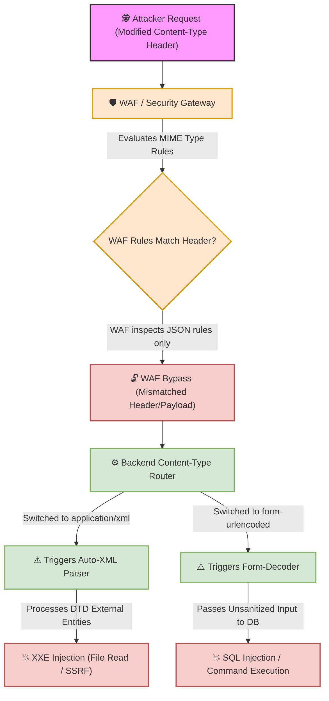

# 🌐 Lab 24: Content-Type Parsing Mechanics, Content-Type Confusion & Security Risks


## 📌 Overview

The **`Content-Type`** header in HTTP requests specifies the media type of the payload body, instructing the backend server which processing library or parser middleware to invoke. 

Penetration testers leverage **Content-Type Confusion** techniques—deliberately altering header values and body structures—to expose hidden backend parsers (triggering **XXE**), bypass Web Application Firewall (**WAF**) filters, and circumvent Cross-Origin Resource Sharing (**CORS**) preflight checks during **CSRF** exploitation.

---

## ⚙️ Content-Type Headers & Server Parsing Routing

The backend request router reads the incoming `Content-Type` header to select the corresponding parser library:

| Content-Type Header | Backend Parser Library | Expected Body Structure | Security & Architectural Implications |
| :--- | :--- | :--- | :--- |
| **`application/json`** | JSON Parser | Key-value objects (`{"key": "value"}`) | Non-simple request (Triggers browser CORS `OPTIONS` preflight). |
| **`application/x-www-form-urlencoded`** | URL-Decoder / Form Parser | Key-value string pairs (`key=val&key2=val2`) | Simple request; decoded via URL-encoding rules. |
| **`multipart/form-data`** | Multipart Form Parser | Boundary-delimited data chunks (`--boundary`) | Used for binary/file uploads; dynamic boundary parsing. |
| **`text/xml` / `application/xml`** | XML DOM / SAX Parser | XML Documents (`<xml>...</xml>`) | **Primary vector for XML External Entity (XXE)** & XML Bomb DoS. |
| **`text/plain`** | Plaintext / Raw Parser | Unstructured raw string text | Simple request (Bypasses CORS preflight requirements). |

---

## 🛠️ Security Risks & Attack Vectors (Content-Type Confusion)

### 1. XML External Entity (XXE) Exploitation
Web applications using JSON APIs may still retain active XML parsing libraries in their backend dependencies (e.g., automated content negotiation middleware). 

By changing `Content-Type: application/json` to `application/xml` or `text/xml` and converting the payload body to XML syntax containing inline Document Type Definitions (`<!DOCTYPE ... >`), an attacker can force the backend to invoke an unshielded XML parser, escalating to arbitrary file read (`/etc/passwd`) or Server-Side Request Forgery (SSRF).

### 2. Web Application Firewall (WAF) Bypass via Parser Differentials
WAFs inspect incoming HTTP bodies based on expected signatures and MIME types. If a WAF rule set specifically inspects `application/json` payloads for SQL Injection signatures, changing the header to `application/x-www-form-urlencoded` or `text/plain` while sending form-encoded or raw payloads may cause the WAF to skip payload inspection entirely while the backend application server successfully decodes and executes the malicious input.

### 3. Cross-Site Request Forgery (CSRF) Preflight Bypass
Browsers classify requests using custom headers or `application/json` as **Non-Simple Requests**, forcing the browser to issue a preflight `OPTIONS` check under CORS rules before sending the main request. 

Changing the `Content-Type` header to `text/plain` or `application/x-www-form-urlencoded` reclassifies the HTTP request as a **Simple Request**, allowing cross-origin browsers to execute direct POST actions without triggering preflight restrictions.

---

## 🔄 Execution Pipeline: Content-Type Confusion Vectors



---

## 🧪 Practical Scenarios, Questions & Technical Evaluations

### 🔹 Field Scenario: Banking API Audit & Content-Type Manipulation

> [!CAUTION]
> **Field Condition:**  
> During a security assessment of a financial REST API, you intercept a fund transfer request:
> 
> ```http
> POST /api/v1/transfer HTTP/1.1
> Host: bank.com
> Content-Type: application/json
> 
> {"to": "account_b", "amount": 100}
> ```

* **Questions:**
  1. How would you modify the `Content-Type` header and payload structure to audit the server for a hidden **XXE** vulnerability?
  2. Why would a penetration tester change `Content-Type: application/json` to `Content-Type: application/x-www-form-urlencoded` when testing for **SQL Injection (SQLi)**?

---

* **Student Analysis:**
  > **1. XXE Audit Payload:** To test for XXE, change `Content-Type: application/json` to `application/xml` (or `text/xml`) and convert the JSON payload into XML format containing a DTD payload:
  > ```xml
  > <?xml version="1.0" encoding="UTF-8"?>
  > <!DOCTYPE foo [<!ENTITY xxe SYSTEM "file:///etc/passwd">]>
  > <transfer>
  >   <to>&xxe;</to>
  >   <amount>100</amount>
  > </transfer>
  > ```
  > This checks whether the server has an active XML parser enabled that processes external entities.  
  > **2. SQLi / WAF Bypass Technique:** Changing the header to `application/x-www-form-urlencoded` exploits a **Parser Differential**. A WAF configured only to inspect JSON bodies will skip inspecting form-encoded parameters, allowing the SQL Injection payload to pass through to the backend uninspected.

---

* **Technical Security Breakdown & Evaluation:**
  * **Verdict:** ✅ **100% Accurate Security Assessment.**
  * **XXE Parser Activation Mechanics (Question 1):**  
    Many modern backend frameworks (such as Spring Boot or ASP.NET Web API) automatically handle Content Negotiation. If the XML parser module is present on the classpath, modifying the `Content-Type` header forces the framework to route the request body to the XML deserializer rather than the JSON deserializer. If entity resolution is enabled (`expandEntityReferences = true`), the parser reads local file system contents (`file:///etc/passwd`).
  * **Parser Differential Mechanics (Question 2):**  
    WAF inspection engines parse HTTP payloads using strict MIME-type rulesets. If a WAF rule is bound specifically to `Content-Type: application/json`, transmitting `to=account_b' OR 1=1--&amount=100` under `application/x-www-form-urlencoded` bypasses WAF inspection logic, while permissive backend parameter parsers extract and evaluate the SQLi payload cleanly.
